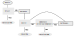

# About this course

- Compulsory non-credit course (pass marks: 35%)

- Does not count towards composite score, but you need to pass
--

- Official syllabus

	- Basics in Programming: flow-charts, logic in programming

	- Common syntax

	- Handling input/output files

	- Sorting

	- Iterative algorithms

	- Simulations from statistical distributions

	- Programming for statistical data analyses: regression,
      estimation, parametric tests

---

# Tentative plan

- Introduction to basic ideas 

- Discuss some prototype problems

- Practice

	- A high-level overview of R

	- Basic usage of R

	- Discuss various solutions to prototype problems
	
- Theory

	- Algorithms: correctness and runtime analysis (mostly sorting)

	- Computer representation of numbers

	- Conditioning and stability

---

# Exercise

- Think of tasks that cannot be easily done without a computer

- Could be both related and unrelated to what you are studying

---

# Some simple numeric examples

- Problems involving scalar objects only:

	- Is a given natural number $n \in \mathbb{N}$ prime?

	- Given integer $k \geq 0$, compute its factorial $k!$, and $\log k!$

	- Given integers $n, k \geq 0$ such that $k \leq n$, compute $n \choose k$
	
--

- Problems that most likely will need more complicated objects to be solved:

	- Find all prime numbers less than a given number $N$

	- Sort a given collection (vector) of numbers

	- Produce a random permutation of a given vector of numbers

	- Given set $S$ and query object $x$, determine whether $x \in S$ (set membership)

- We will discuss vectors, but probably not more complicated data structures

---

# Some examples of simulation

- Simple random walk (+1 or -1 with probability $p$ and $1-p$): 

	- How long does it take to return to zero for the first time?

	- When was the last return to zero before time $2n$?
--

- Toss a coin (with probability of head $p$) until you get $k$
  consecutive heads. 
  
    - Based on observed value, can you test for $p = \frac12$?
--
  
- Given a game of snakes and ladders, how many throws of the dice does
  it take to reach the end?
--

- Shuffle a deck of cards. 

	- How can we probabilistically model a shuffle?

	- How many times do we need to shuffle to make the deck
	  approximately random?
  
	- How can we "test" for randomness?

---

# Some generally important problems

$\newcommand{\bs}{\boldsymbol}$

- Given a function $f$, solve for $f(x) = 0$, e.g., 

	- solve non-linear equations like $e^x + \sin x = 0$

	- solve linear equations $A \bs{x} = \bs{b}$ for
      vector $\bs{x}$ (e.g., as part of fitting linear models)
--

- Optimization: given a function $f$, find $\bs{x}$ where $f(\bs{x})$ is minimized

	- Sometimes this can be done by solving $\nabla f(\bs{x}) = \bs{0}$ 

	- Other solutions may be more practical depending on context

---

# Algorithms

- We will spend a lot of time discussing algorithms

- An algorithm is essentially a set of instructions to solve a problem

- Algorithms usually require some inputs

- Instructions are executed sequentially, finally resulting in an
  output (also called _return value_)

- You can think of an algorithm as a recipe (inputs: ingredients, output: food!)

---

layout: true

# Example: is a given number $n$ prime?

---

- Basic idea: see if $n$ is divisible by any number between $2$ and $n-1$

- Obviously, enough to check whether $n$ is divisible by any number between $2$ and $\sqrt{n}$

- Intuitively, the second approach is more "efficient"

- Also, we can stop as soon as we find the first divisor

---

- Simple algorithms are often easy to understand as a _flowchart_

---

- But we will usually write algorithms in the form of _pseudo-code_ as follows:

.algorithm[
.name[`is\_prime(n)`]
i := 2
__while__ (i $\leq$ sqrt(n)) {
    __if__ (n mod i == 0) {
        __return__ FALSE
    }
    i := i + 1
}
__return__ TRUE
]

- Here we skip checking whether $n > 1$ (and that it is an integer)

---

layout: true

# How to interpret an algorithm?

---

- The meaning of this algorithm / pseudo-code should be more or less obvious

- Assumes availability of certain basic operators / functions (mod, sqrt)

- We often employ some _conventions_ and use some _structures_ in pseudo-code

- For example,

.algorithm[
.name[`is\_prime(n)`]
i := 2                    // variable assignment
__while__ (i $\leq$ sqrt(n)) {    // loop while condition holds
    __if__ (n mod i == 0) {   // branch if condition holds
        __return__ FALSE      // exits with output value
    }                     // end of blocks within loops, branches, etc.
    i := i + 1            // update variable value
}
__return__ TRUE
]

---

- It is important to make sure that an algorithm makes sense

- Steps are executed sequentially, so the sequence must be clear
	
- It must be possible to evaluate each step

	- All variables used must have been defined in a previous step
	
	- It is OK to call other functions (or algorithms), but they must be clearly defined

	- It is even OK for an algorithm to call itself (this is known as _recursion_)

---

layout: true

# Pseudo-code

---

- The general structure of algorithms is derived from a language called [ALGOL](https://en.wikipedia.org/wiki/ALGOL)

- However, there are no fixed rules that pseudo-code must follow

- An alternative form of our `is_prime` algorithm could be:

.algorithm[
.name[`is\_prime(n)`]
i = 2                  // different assignment operator
__while__ i $\leq$ sqrt(n)     // end of loop indicated by indentation
    __if__ n mod i == 0
        __return__ FALSE
    i = i + 1
__return__ TRUE
]

---

- Another form could be:

.algorithm[
.name[`is\_prime(n)`]
i $\leftarrow$ 2                 // yet another assignment operator
__while__ i $\leq$ sqrt(n)     // end of loop indicated by __end__ keyword
    __if__ n mod i == 0
        __return__ FALSE
    __end__
    i $\leftarrow$ i + 1
__end__
__return__ TRUE
]

- Any of these forms are fine as long as 

	- the steps of the algorithm are clearly specified

	- the essential ideas are expressed without ambiguity

---

layout: false

# Theoretical questions about algorithms

* __Is an algorithm correct?__ To be correct, an algorithm must

	- stop after a finite number of steps, and 

	- produce the _correct output_ for _all possible inputs_ (i.e.,
	  all _instances_ of the problem).
  
* __How efficient is the algorithm?__ 

	- What resources does the algorithm need to run, typically in
	  terms of time and storage? 
	  
	- How does it compare with other algorithms for the same problem?

--

* To answer such questions, we need a model for computation

---

# Ingredients of a computational model

* There are actually many different approaches to programming 

* We will mostly consider [structured programming](https://en.wikipedia.org/wiki/Structured_programming)

* Characterized by use of various control flow constructs (if, then,
  while, for, etc.) and
  [block structures](https://en.wikipedia.org/wiki/Code_block)
--

* More specifically, we will focus of [procedural programming](https://en.wikipedia.org/wiki/Procedural_programming)

	* Characterized by use of modular procedures (usually called functions)

	* We will be mainly interested in procedures that perform some
	  computations

	* Most algorithms we discuss will directly correspond to
      procedures or functions when implemented
--

* We will not discuss other kinds of programs (e.g., operating system,
  web browser, editor, etc.)

---

class: center middle

# Questions?

