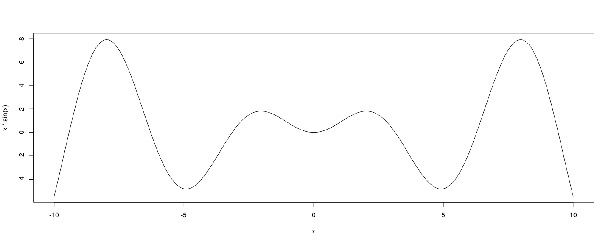

layout: true

# Recap

---

* Lazy evaluation + `substitute()` lets a function obtain the expression supplied to an argument

```{r opts, echo = FALSE, results = "hide", warning = FALSE, message = FALSE}
opts_chunk$set(cache = FALSE, cache.path='~/knitr-cache/icp-nseval-2/', autodep = TRUE,
               comment = "", warning = TRUE, message = TRUE,
               knitr.table.format = "html",
               fig.width = 15, fig.height = 6, dpi = 96, fig.path='figures/nseval-2-')
options(warnPartialMatchDollar = FALSE, width = 100)
```

* A slightly modified version of an example from last time

```{r}
withCall <- function(e) return(list(value = e, call = substitute(e)))
withCall(sqrt(10))
withCall(rbind(rnorm(5), rexp(5)))
```

---

* For example, this is how `plot()` constructs nice axis labels 

```r
x <- seq(-10, 10, length.out = 201)
plot(x = x, y = x * sin(x), type = "l") 
```




---

layout: true

# Non-standard evaluation

---

* Another common use of this technique is to simplify variable references

* Consider the following method to list all `choose(5, 2)` combinations

```{r}
g <- expand.grid(a = 1:5, b = 1:5)
g$b > g$a
g[ g$b > g$a , ]
```

---

* Referring to all variables in `g` using `g$...` is cumbersome

* We can in principle simplify this (referring to `g` only once) using

```{r}
g[ eval(quote(b > a), g), ]
```

---

* Several R functions make this even simpler

* A general purpose (generic) function is `with()` 

```{r}
with
with.default
with(g, b > a) # equivalent to eval(quote(b > a), envir = g)
```

---

* This can be used as follows

```{r}
g[ with(g, b > a), ]
```

---

* For this particular purpose, there is an even more convenient function

```{r}
subset(g, b > a)
```

---

* A popular add-on package for data manipulation, called
  [dplyr](https://dplyr.tidyverse.org/), has a similar function `filter()`

```{r}
dplyr::filter(g, b > a)
```

* [dplyr](https://dplyr.tidyverse.org/) has several other functions that behave similarly

* It is highly recommended for routine data manipulation tasks

---

* Other functions that support similar features are 

	- `transform()`, `dplyr::mutate()` to add new variables that are
      functions of existing variables
	  
	- `dplyr::select()` to select a subset of columns (which `subset()` can also do)

	- `lm()` and many other modeling functions
	
	- `xtabs()` for creating cross-tabulations
	
	- Data visulization packages like lattice and ggplot2 


---

* Another example:

```{r}
suppressMessages(library(dplyr))
mtcars <- mutate(mtcars, am = factor(am))
summarise(group_by(mtcars, am), mean_mpg = mean(mpg))
```

* Equivalent calculation without using add-on packages

```{r}
with(mtcars, tapply(mpg, am, FUN = mean))
```

---

* A more complicated example:

```{r}
summarise(group_by(mtcars, am), ols_coef = coef(lm(mpg ~ wt)), which = c("intercept", "slope"))
```

* Equivalent calculation without using add-on packages

```{r}
sapply(split(mtcars, mtcars$am), function(d) coef(lm(mpg ~ wt, data = d)))
```

---

* Of course, all these can be done using C-type loops, but that is
  much more complicated and error-prone

* I will not explore dplyr any further, but you should learn more about it online

* The `*apply()` type functions are generally useful, and we will discuss them in more detail

---

* Another example: replicating a simulation experiment

* Consider this example from our previous assignment:

```{r}
n <- 20
x <- sample(n, 2)
max(x) %% min(x) == 0
```

* To estimate the probability of this event, we want to run it several
  times and compute proportion
  
---

* We have seen how to do this using a loop

* An alternative approach is to use the `replicate()` function

```{r}
replicate(10, {
    x <- sample(n, 2)
    max(x) %% min(x) == 0
})
```

* `replicate()` takes the _expression_ supplied as its second argument and evauates it multiple times

```{r}
s <- replicate(5000, {
    x <- sample(n, 2)
    max(x) %% min(x) == 0
})
sum(s) / length(s) # estimated probability of success
```

---

layout: true

# Return value of `replicate()`

---

* The return value of `replicate()` depends on what the expression returns when evaluated

* In the above example, each evaluation results in a scalar logical

* In that case, the results are aggregated to produce a vector
--

* If the result is always a vector of same length (greater than one), the result is combined into a matrix

```{r}
quantile(rnorm(500), probs = c(0.25, 0.5, 0.75))
replicate(6, quantile(rnorm(500), probs = c(0.25, 0.5, 0.75)))
```

---

* If the result has inconsistent length, the result is a list

```{r}
set.seed(20200101)
replicate(6, unique(sample(10, 5, replace = TRUE)))
```

---

* This may sometimes lead to unanticipated behaviour

```{r}
set.seed(20200101)
replicate(2, unique(sample(10, 5, replace = TRUE)))
```
--

* When output length is known to be variable, it is better to
  explicitly disable simplification

```{r}
set.seed(20200101)
replicate(2, unique(sample(10, 5, replace = TRUE)), simplify = FALSE) # always return list
```


---

layout: false
class: middle, center

# Questions?

