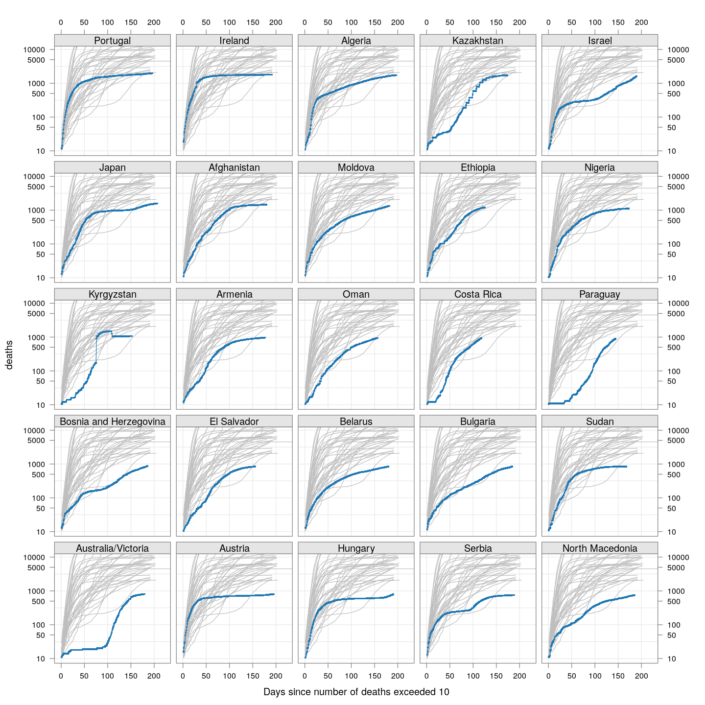

To understand how the COVID-19 pandemic has spread over time in
various countries, the number of cases (or deaths) over time is not
necessarily the best quantity to visualize. Instead, we have used the
[doubling time](doubling), which is the number of days it took for the
total number of cases to reach the current number from when it was
half the current number. The doubling time is a measure of the rate of
growth: if it does not change with time in a country, the number of
cases is growing exponentially. With measures to control spread, the
doubling time should systematically increase with time.


Due to lack of testing, or changes in testing protocols, or various
other reasons, the reported number of positive cases may only be a
fraction of the true number of cases. It is possible, but less likely,
for _deaths_ due to COVID-19 going unattributed, especially in
countries where the virus has already spread enough to cause a
substantial number of deaths.


This analysis considers the evolution of doubling times of deaths in
countries where the number of deaths have already exceeded 100. As
before, the analysis is based on data made available by [JHU
CSSE](https://github.com/CSSEGISandData/COVID-19/) on Github. 


Here is the [source](doubling-deaths.rmd) of this analysis, in case
you want to experiment with it. The analysis is done using R, click <a
href="#" data-toggle="collapse" data-target="div.sourceCode"
aria-expanded="true">here</a> to show / hide the R code.


## Crude death rates

First, we download the data and read it in, retaining only countries /
regions with at least 100 deaths.


```r
TARGET.cases <- "time_series_covid19_confirmed_global.csv"
TARGET.deaths <- "time_series_covid19_deaths_global.csv"
SURL <- "https://github.com/CSSEGISandData/COVID-19/raw/master/csse_covid_19_data/csse_covid_19_time_series"
## To download the latest version, delete the files and run again
for (target in c(TARGET.cases, TARGET.deaths))
{
	if (!file.exists(target))
        download.file(sprintf("%s/%s", SURL, target), destfile = target)
}
covid.cases <- read.csv(TARGET.cases, check.names = FALSE, stringsAsFactors = FALSE)
covid.deaths <- read.csv(TARGET.deaths, check.names = FALSE, stringsAsFactors = FALSE)
if (!identical(dimnames(covid.cases), dimnames(covid.deaths)))
    stop("Cases and death data have different structure... check versions.")
keep <- covid.deaths[[length(covid.deaths)]] > 99 # at least 99 deaths
covid.cases <- covid.cases[keep, ]
covid.deaths <- covid.deaths[keep, ]
```

This version was last updated using data downloaded on 
2020-03-28.


Next, we extract the time series data of each subset as a data matrix,
with a crude "smoothing" to account for lags in updating data: If two
consecutive days have the same total count followed by a large
increase on the following day, then the most likely explanation is
that data was not updated on the second day. In such cases, the count
of the middle day is replaced by the geometric mean of its neighbours.


```r
correctLag <- function(x)
{
    n <- length(x)
    stopifnot(n > 2)
    for (i in seq(2, n-1))
        if (x[i] == x[i-1])
            x[i] <- sqrt(x[i-1] * x[i+1])
    x
}
extractCasesTS <- function(d)
{
    x <- t(data.matrix(d[, -c(1:4)]))
    x[x == -1] <- NA
    colnames(x) <-
        with(d, ifelse(`Province/State` == "", `Country/Region`,
                       paste(`Country/Region`, `Province/State`,
                             sep = "/")))
    apply(x, 2, correctLag)
}
xcovid.cases <- extractCasesTS(covid.cases)
xcovid.deaths <- extractCasesTS(covid.deaths)
```

Which countries are the worst affected in terms of the latest absolute
numbers so far?


```r
total.deaths <- apply(xcovid.deaths, 2, tail, 1)
total.cases <- apply(xcovid.deaths, 2, tail, 1)
dotplot(sort(total.deaths),
        xlab = "Total deaths (NOTE: log scale)",
        ylab = "Countries / regions (ordered by deaths per cases)",
        scales = list(x = list(alternating = 3, log = TRUE,
                               equispaced.log = FALSE)))
```


How do the countries compare in terms of death rates? The following
plot shows how the proportion of deaths over number of confirmed
cases, on any given day, have changed over time.


```r
porder <- rev(order(total.deaths))
death.rate <- 100 * (xcovid.deaths / xcovid.cases)
start.date <- as.Date("2020-01-22")
xat <- pretty(start.date + c(0, nrow(death.rate)-1))
xyplot(ts(death.rate[, porder], start = start.date),
       type = "o", pch = ".", cex = 3, grid = TRUE,
       scales = list(alternating = 3,
                     x = list(at = xat, labels = format(xat, format = "%d %b")),
                     y = list(relation = "same")),
       xlab = NULL, ylab = "Death rate (per cent)",
       as.table = TRUE, between = list(x = 0.5, y = 0.5),
       ylim = extendrange(range(tail(death.rate, 10))))
```


However, these numbers are obviously underestimates, because the
denominator contains (many) recently diagnosed patients that have not
yet died, but many of whom will actually die. The correct way to
estimate the death rate will be to only consider closed cased
(confirmed cases who have either died or been cured). But that data is
not easily available (the number of _recovered_ patients by date is
available, but that is not enough).

A _crude_ alternative is to assume that the correct denominator for
the proportion of deaths of not the _current_ number of cases, but
rather the number of cases a few days ago (that represents the
population of patients that would have died by now if they were to die
at all).

But what should that lag be? We have no idea, so we tried lags of one
day, two days, three days, and so on, and settled on a lag of __7
days__ as the smallest lag for which the lag-adjusted death rate
stabilized (being the region with the longest history, we expect it to
give the most stable estimate). The following plot shows how the
lag-adjusted estimated death rates have changed over time.


```r
LAG <- 7 # lowest lag for which Hubei estimates flatten out
death.rate <- 100 * tail(xcovid.deaths, -LAG) / head(xcovid.cases, -LAG)
start.date <- as.Date("2020-01-22") + LAG
xat <- pretty(start.date + c(0, nrow(death.rate)-1))
xyplot(ts(death.rate[, porder], start = start.date),
       type = "o", pch = ".", cex = 3, grid = TRUE,
       scales = list(alternating = 3,
                     x = list(at = xat, labels = format(xat, format = "%d %b")),
                     y = list(relation = "same")),
       xlab = NULL, ylab = "Death rate with one-week lag  (per cent)",
       as.table = TRUE, between = list(x = 0.5, y = 0.5),
       ylim = extendrange(range(tail(death.rate, 10))))
```


As we can see, the rates have stabilized in most countries with a
reasonably long history.

Why are the rates so different across countries? That is difficult to
answer. It possibly depends on how overwhelmed the health-care system
is, but it is also important to remember that this is not the death
rate among all _infected_ individuals, but rather only among all
_identified_ individuals. In countries where possibly infected
patients are not tested if their symptoms are mild, then the estimated
death rate will be artificially high.


## The doubling time

Finally, we look at the doubling time of deaths across these
countries. The grey line represents the corresponding doubling time of
the number of cases.


```r
tdouble <- function(n, x, min = 50)
{
    if (x[n] < min) return (NA_real_)
    x <- head(x, n)
    x <- c(0, x[x > 0])
    i <- seq_along(x)
    f <- approxfun(x, i)
    diff(f(max(x) * c(0.5, 1)))
}
doubling.ts <- function(region, d, min = 50)
{
    t <- seq(as.Date("2020-01-22"), by = 1, length.out = nrow(d))
    td <- sapply(1:nrow(d), tdouble,
                 x = d[, region, drop = TRUE], min = min)
    data.frame(region = region, date = t, tdouble = td)
}
```


```r
regions <- colnames(xcovid.deaths)[porder]
devolution.deaths <-
    droplevels(na.omit(do.call(rbind,
                               lapply(regions, doubling.ts,
                                      d = xcovid.deaths, min = 50))))
devolution.cases <-
    droplevels(na.omit(do.call(rbind,
                               lapply(regions, doubling.ts,
                                      d = xcovid.cases, min = 50))))
p.deaths <-
    xyplot(tdouble ~ date | factor(region, levels = regions),
           data = devolution.deaths, type = "o", pch = 16, grid = TRUE,
           xlab = "Date", ylab = "Doubling time for deaths (days)",
           scales = list(alternating = 3, x = list(rot = 45)),
           ylim = c(NA, 20), as.table = TRUE, between = list(x = 0.5, y = 0.5))
p.cases <-
    xyplot(tdouble ~ date | factor(region, levels = regions),
           data = devolution.cases, type = "l", pch = 16, grid = TRUE, col = "grey50",
           xlab = "Date", ylab = "Doubling time for deaths (days)",
           scales = list(alternating = 3, x = list(rot = 45)),
           ylim = c(NA, 20), as.table = TRUE, between = list(x = 0.5, y = 0.5))
p.deaths + p.cases
```



