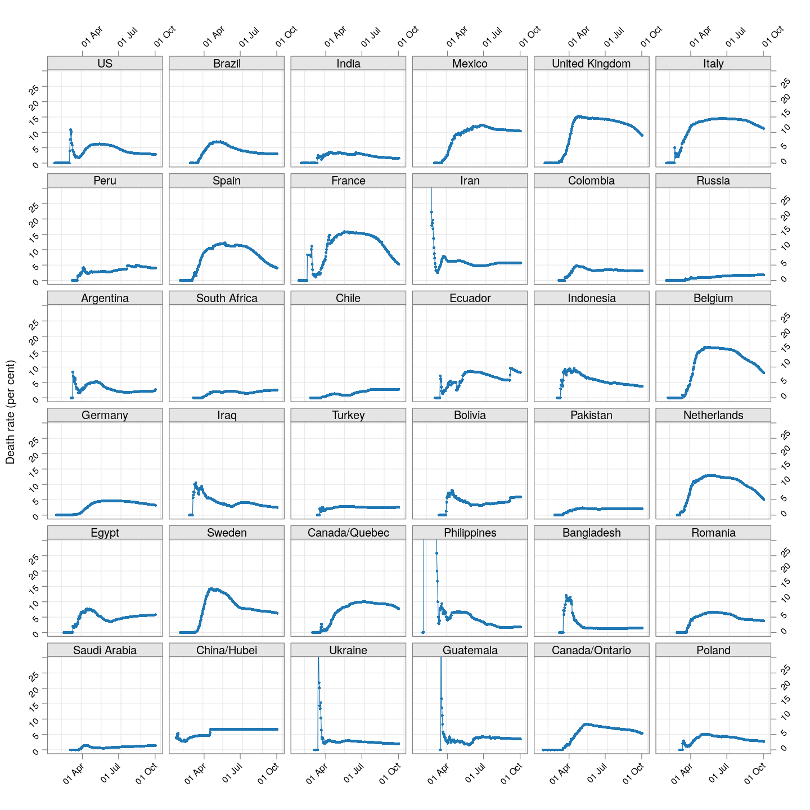
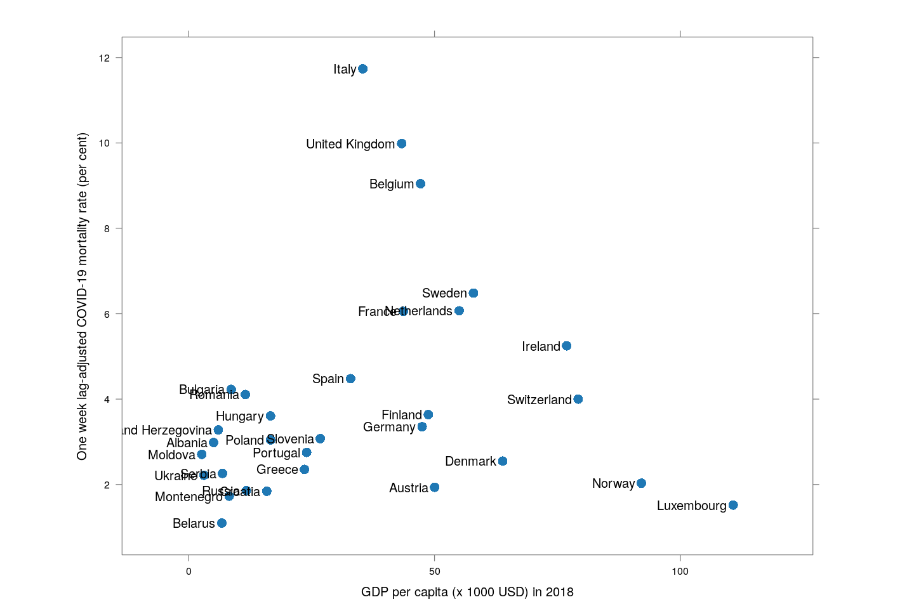

```r
TARGET.cases <- "time_series_covid19_confirmed_global.csv"
TARGET.deaths <- "time_series_covid19_deaths_global.csv"
SURL <- "https://github.com/CSSEGISandData/COVID-19/raw/master/csse_covid_19_data/csse_covid_19_time_series"
## To download the latest version, delete the files and run again
for (target in c(TARGET.cases, TARGET.deaths))
{
	if (!file.exists(target))
        download.file(sprintf("%s/%s", SURL, target), destfile = target)
}
covid.cases <- read.csv(TARGET.cases, check.names = FALSE, stringsAsFactors = FALSE)
covid.deaths <- read.csv(TARGET.deaths, check.names = FALSE, stringsAsFactors = FALSE)
if (!identical(dimnames(covid.cases), dimnames(covid.deaths)))
    stop("Cases and death data have different structure... check versions.")
keep <- covid.deaths[[length(covid.deaths)]] > 99 # at least 99 deaths
covid.cases <- covid.cases[keep, ]
covid.deaths <- covid.deaths[keep, ]
```


[This note was last updated using data downloaded on 
2020-03-29. Here is the
[source](deaths.rmd) of this analysis. Click <a href="#"
data-toggle="collapse" data-target="div.sourceCode"
aria-expanded="true">here</a> to show / hide the R code used. ]


To understand how the COVID-19 pandemic has spread over time in
various countries, the number of cases (or deaths) over time is not
necessarily the best quantity to visualize. Instead, we have used the
[doubling time](doubling), which is the number of days it took for the
total number of cases to reach the current number from when it was
half the current number. The doubling time is a measure of the rate of
growth: if it does not change with time in a country, the number of
cases is growing exponentially. With measures to control spread, the
doubling time should systematically increase with time.


Another very important aspect of the COVID-19 pandemic is its
mortality rate. That is, once an individual is infected, how likely is
he/she to die? This of course depends on various attributes of the
individual such as age and other underlying conditions, but even a
crude (marginal) country-specific mortality rate is rather difficult
to estimate.


## The problem with the naive death rate estimate

The main difficulty is in knowing the size of the vulnerable
population. Although it is possible that deaths due to COVID-19 are
not attributed to it, this is not very likely to happen, especially in
countries where the virus has already spread enough to cause a
substantial number of deaths. On the other hand, the reported number
of confirmed cases may only be a fraction of the true number of cases,
either due to lack of testing, or changes in testing protocols, or
various other reasons. Thus, the best we can hope for is to estimate
the mortality rate among _identified_ cases.

There is yet another problem. The cumulative daily number of confirmed
cases and deaths are avaiable (e.g., from [JHU
CSSE](https://github.com/CSSEGISandData/COVID-19/) on Github), and one
could naively estimate the mortality rate by dividing the (current)
total number of deaths by the total number of infections. However,
doing this will always underestimate the mortality rate, because the
denominator contains (many) recently diagnosed patients that have not
yet died, but many of whom will actually die. As pointed out
[here](https://medium.com/@tomaspueyo/coronavirus-act-today-or-people-will-die-f4d3d9cd99ca),
the correct way to estimate the death rate is to consider only
_closed_ cases (confirmed cases who have either died or been
cured). But that data is not easily available (the number of
_recovered_ patients by date is available, but that is not enough).


The plot below shows how the naive death rates (proportion of deaths
over number of confirmed cases), on any given day, have changed over
time for countries with at least 100 deaths.^[As [before](doubling),
we apply a crude "smoothing" to account for lags in updating data: If
two consecutive days have the same total count followed by a large
increase on the following day, then the most likely explanation is
that data was not updated on the second day. In such cases, the count
of the middle day is replaced by the geometric mean of its
neighbours.] Although the estimate is eventually (asymptotically)
supposed to stabilize (as the fraction of "active" cases decreases),
this has clearly not happened yet for most countries.


```r
correctLag <- function(x)
{
    n <- length(x)
    stopifnot(n > 2)
    for (i in seq(2, n-1))
        if (x[i] == x[i-1])
            x[i] <- sqrt(x[i-1] * x[i+1])
    x
}
extractCasesTS <- function(d)
{
    x <- t(data.matrix(d[, -c(1:4)]))
    x[x == -1] <- NA
    colnames(x) <-
        with(d, ifelse(`Province/State` == "", `Country/Region`,
                       paste(`Country/Region`, `Province/State`,
                             sep = "/")))
    apply(x, 2, correctLag)
}
xcovid.cases <- extractCasesTS(covid.cases)
xcovid.deaths <- extractCasesTS(covid.deaths)
total.deaths <- apply(xcovid.deaths, 2, tail, 1)
total.cases <- apply(xcovid.deaths, 2, tail, 1)
```


```r
porder <- rev(order(total.deaths))
death.rate <- 100 * (xcovid.deaths / xcovid.cases)
dr.naive.latest <- tail(death.rate, 1)
start.date <- as.Date("2020-01-22")
xat <- pretty(start.date + c(0, nrow(death.rate)-1))
(dr.naive <-
     xyplot(ts(death.rate[, porder], start = start.date),
            type = "o", grid = TRUE, layout = c(4, NA),
            par.settings = simpleTheme(pch = 16, cex = 0.5), 
            scales = list(alternating = 3,
                          x = list(at = xat, labels = format(xat, format = "%d %b")),
                          y = list(relation = "same")),
            xlab = NULL, ylab = "Death rate (per cent)",
            as.table = TRUE, between = list(x = 0.5, y = 0.5),
            ylim = extendrange(range(tail(death.rate, 10))))
)
```




## The lag-adjusted death rate

A very simple alternative is to assume that the correct denominator
for the proportion of deaths of not the _current_ number of cases, but
rather the number of cases a few days ago (representing the population
of patients that would have died by now if they were to die at all).

But what should that lag be? We know that two weeks is probably long
enough (probably too long), but otherwise we do not have enough
information to guess. So, we tried lags of one day, two days, three
days, and so on, and finally settled on a lag of __7 days__ because it
is the _smallest_ lag for which the lag-adjusted death rate stabilized
in Hubei (China); being the region with the longest history, we expect
it to give the most stable estimate. The following plot shows how this
lag-adjusted death rates has changed over time, and compares it with
the naive death rate.


```r
LAG <- 7 # lowest lag for which Hubei estimates flatten out
death.rate <- 100 * tail(xcovid.deaths, -LAG) / head(xcovid.cases, -LAG)
dr.adjusted.latest <- tail(death.rate, 1)
start.date <- as.Date("2020-01-22") + LAG
xat <- pretty(start.date + c(0, nrow(death.rate)-1))
dr.adjusted <- 
     xyplot(ts(death.rate[, porder], start = start.date),
            type = "o", layout = c(4, NA),
            par.settings = simpleTheme(pch = 16, cex = 0.5), 
            col = ct$superpose.symbol$col[2],
            scales = list(alternating = 3,
                          x = list(at = xat, labels = format(xat, format = "%d %b")),
                          y = list(relation = "same")),
            xlab = NULL, ylab = "Death rate (per cent)",
            as.table = TRUE, between = list(x = 0.5, y = 0.5),
            ylim = c(0, 30))
update(dr.adjusted + dr.naive,
       auto.key = list(lines = TRUE, points = FALSE, columns = 2, type = "o",
                       text = c("Naive estimate", "One week lag-adjusted estimate")))
```


The adjusted death rates have less systematic trends than the naive
estimate, but clearly there is still a lot of instability.


Why are the rates so different across countries? That is difficult to
answer at this point. It possibly depends on how overwhelmed the
health-care system is, but it is also important to remember that this
is not the death rate among all _infected_ individuals, but rather
only among all _identified_ individuals. In countries where possibly
infected patients are not tested if their symptoms are mild, then the
estimated death rate will be artificially high. Countries may also not
be consistent in which deaths they are attributing to COVID-19.


A useful, but not surprising, proxy for how efficiently a country is
testing turns out to be its GDP. The following plot shows, only for
European countries (which should be otherwise more or less
homogeneous), the relationship between per capita GDP as of 2018
(source: [World Bank](https://data.worldbank.org/)) and adjusted
mortality rate.


```r
ppgdp <- read.csv("PPGDP_2018.csv") # world bank data
data(UN, package = "carData")
latest.dr <- as.data.frame(t(rbind(dr.naive.latest,
                                   dr.adjusted.latest,
                                   tail(xcovid.deaths, 1))))
names(latest.dr) <- c("naive", "adjusted", "tdeaths")
## adjust some names to match
mapNamesUN <- function(s)
{
    s[s == "US"] <- "United States"
    s[s == "Korea, South"] <- "Republic of Korea"
    s[substring(s, 1, 5) == "China"] <- "China"
    s
}
mapNamesWB <- function(s)
{
    s[s == "US"] <- "United States"
    s[s == "Iran"] <- "Iran, Islamic Rep."
    s[s == "Korea, South"] <- "Korea, Rep."
    s[substring(s, 1, 5) == "China"] <- "China"
    s
}
latest.dr <- cbind(latest.dr,
                   country = rownames(latest.dr),
                   ppgdp[mapNamesWB(rownames(latest.dr)), , drop = FALSE],
                   UN[mapNamesUN(rownames(latest.dr)), , drop = FALSE])
with(subset(latest.dr, region == "Europe"),
     xyplot(adjusted ~ (PPGDP_2018/1000), pch = 16, cex = 1.5, aspect = 0.75,
            xlab = "GDP per capita (x 1000 USD) in 2018",
            ylab = "One week lag-adjusted COVID-19 mortality rate (per cent)",
            xlim = extendrange(range(PPGDP_2018/1000), f = 0.15),
            panel = function(x, y, ...) {
                panel.abline(lm(y ~ x, weights = tdeaths), col.line = "grey90", lwd = 3)
                panel.xyplot(x, y, ...)
                panel.text(x, y, labels = country, pos = 2, srt = 0)
            }))
```



The grey line is a weighted linear regression line fit with the number
of deaths as weights.


<!-- Some extra analysis reported in doubling.rmd -->

<!--  Total deaths -->


<!--

The doubling time of deaths across these countries. The grey line
represents the corresponding doubling time of the number of cases.

-->


