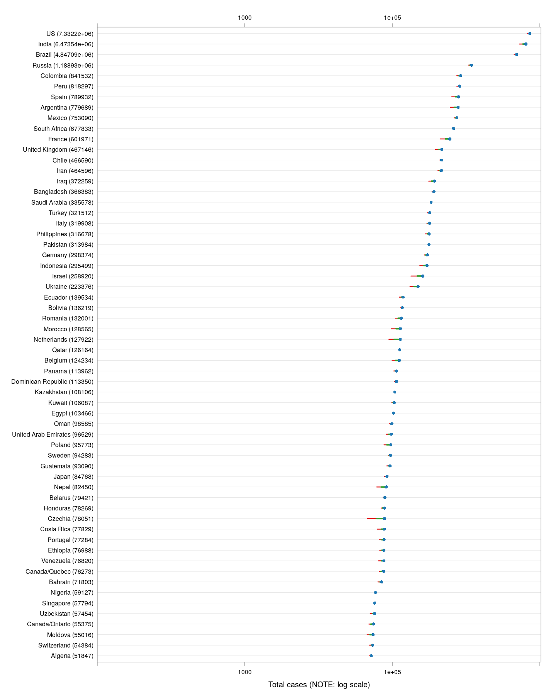
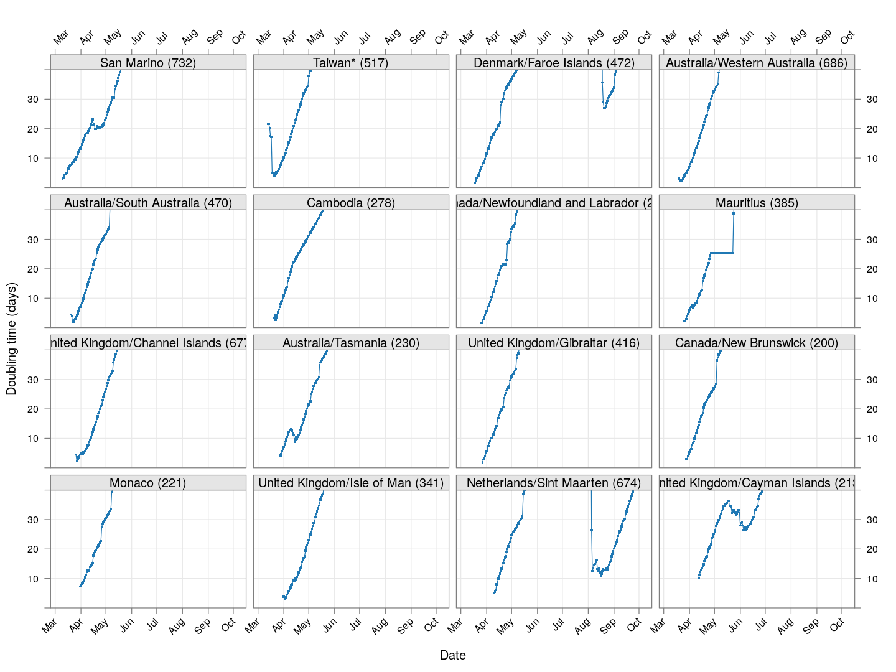

Is "social distancing" working in your country? How is it doing
compared to other countries? How long will it take for the number of
cases to reach 50,000? Or 100,000? Or a million?

This is an attempt to summarize, on an ongong basis, how successfully
various countries / regions are containing the spread COVID-19, based
on a very simple summary statistic: how long it is taking to double
the number of cases, and how this "doubling time" changes over time.

The analysis is based on the official number of _confirmed_ cases,
based on data provided by [JHU
CSSE](https://github.com/CSSEGISandData/COVID-19/raw/master/csse_covid_19_data/csse_covid_19_time_series/time_series_covid19_confirmed_global.csv)
on Github. Not all countries are testing equally aggressively, for
various reasons. For example, India is testing (as on [March
20](https://www.mohfw.gov.in/pdf/ICMRrevisedtestingstrategyforCOVID.pdf))
only symptomatic individuals who are international travelers, contacts
of positive cases, health care workers, and unlinked symptomatic
patients serious enough to be hospitalized.  So, these numbers may not
reflect the actual number of cases. In the long run though, that does
not matter as long as the _proportion_ of true cases being detected
remains more or less stable (even this proportion may change as the
testing poicy is refined).

Here is the [source](doubling.rmd) of this analysis, in case you want
to experiment with it. The analysis is done using R, click 
<a href="#" data-toggle="collapse" data-target="div.sourceCode"
   aria-expanded="true">here</a> to show / hide the R code.

## Executive summary

In most countries, the number of cases are doubling every 3 to 5
days. This means that if you have, say, 1000 cases today, you will
have 50,000 cases in around 3 weeks from today, and a million cases in
one and a half months. Unless the doubling time increases soon.

For more substantive data-driven analysis, see
[here](https://medium.com/@tomaspueyo/coronavirus-act-today-or-people-will-die-f4d3d9cd99ca)
and
[here](https://medium.com/@tomaspueyo/coronavirus-the-hammer-and-the-dance-be9337092b56).


## Preparatory steps

First, we download the data and read it in.


```r
TARGET <- "time_series_covid19_confirmed_global.csv"
## To download the latest version, delete the file and run again
if (!file.exists(TARGET))
    download.file("https://github.com/CSSEGISandData/COVID-19/raw/master/csse_covid_19_data/csse_covid_19_time_series/time_series_covid19_confirmed_global.csv",
                  destfile = TARGET)
covid <- read.csv(TARGET, check.names = FALSE,
                  stringsAsFactors = FALSE)
covid <- subset(covid, `Country/Region` != "Diamond Princess")
```

This version was last updated using data downloaded on 
2020-03-26.


Many of the high numbers are provinces in China, where spread is now
more or less controlled. We consider them separately. Data for the
USA, available separately by state, is considered separately as
well. We exclude cases on cruise ships, which represent small
populations.


```r
covid.china <- subset(covid, `Country/Region` == "China")
covid.row <- subset(covid, `Country/Region` != "China")
```

Next, we extract the time series data of each subset as a data matrix,
with a crude "smoothing" to account for lags in updating data: If two
consecutive days have the same total count followed by a large
increase on the following day, then the most likely explanation is
that data was not updated on the second day. In such cases, the count
of the middle day is replaced by the geometric mean of its neighbours.


```r
correctLag <- function(x)
{
    n <- length(x)
    stopifnot(n > 2)
    for (i in seq(2, n-1))
        if (x[i] == x[i-1])
            x[i] <- sqrt(x[i-1] * x[i+1])
    x
}
extractCasesTS <- function(d)
{
    x <- t(data.matrix(d[, -c(1:4)]))
    x[x == -1] <- NA
    colnames(x) <-
        with(d, ifelse(`Province/State` == "", `Country/Region`,
                       paste(`Country/Region`, `Province/State`,
                             sep = "/")))
    ## Update labels to include current total cases
    colnames(x) <-  sprintf("%s (%g)", colnames(x), x[nrow(x), ])
    apply(x, 2, correctLag)
}
xcovid.china <- extractCasesTS(covid.china)
xcovid.row <- extractCasesTS(covid.row)
```

Outside the US and China, which countries are the worst affected in
terms of the latest absolute numbers so far?


```r
total.row <- sort(apply(xcovid.row, 2, tail, 1))
dotplot(tail(total.row, 60),
        xlab = "Total cases (NOTE: log scale)",
        scales = list(x = list(alternating = 3, log = TRUE,
                               equispaced.log = FALSE)))
```




Unfortunately, the latest numbers don't tell the whole
story. Different countries are at different stages of the pandemic,
and just because the numbers are low _now_ does not mean they will
remain low. We should be more concerned about what is _going_ to
happen, and that depends on what measures various countries / regions
are taking. How can we compare countries at various stages of spread
in terms of something that is actually comparable?

## The doubling time

It is not unreasonable to assume that without any preventive measures,
the number of infections will grow exponentially in the early phases,
when most of the population is uninfected. So estimating a growth rate
assuming exponential growth may sound reasonable. Fortunately, most
countries are taking preventive steps, so this estimate needs to be
updated with time. We look at a very simple measure: at any
given time, how many days ago was the number of cases half of the
current count? We call this the _doubling time_.

This doubling time is a crude estimate of the _current_ rate of spread
of the virus. It is comparable across time as well as countries at
different stages of spread, and additionally, it is not affected by
the proportion of true cases that are being identified, as long as
this proportion does not change substantially. For uncontrolled
exponential growth, we expect the doubling time to remain constant. If
measures are being effective, we should see the doubling time
increasing.

To estimate the doubling times, we use the R function `approxfun()` to
do linear interpolation with day as function of number, and then use
it to evaluate the "day" at which the number was half of the current
count.  To see how the doubling time has evolved over time, we compute
the doubling time using data upto a given timepoint, but only starting
from days when the total count has exceeded 50, so that the estimates
are not meaningless.


```r
tdouble <- function(n, x, min = 50)
{
    if (x[n] < min) return (NA_real_)
    x <- head(x, n)
    x <- c(0, x[x > 0])
    i <- seq_along(x)
    f <- approxfun(x, i)
    diff(f(max(x) * c(0.5, 1)))
}
doubling.ts <- function(region, d, min = 50)
{
    t <- seq(as.Date("2020-01-22"), by = 1, length.out = nrow(d))
    td <- sapply(1:nrow(d), tdouble,
                 x = d[, region, drop = TRUE], min = min)
    data.frame(region = region, date = t, tdouble = td)
}
```


## The situation in China

Let's do this first for the provinces of China that had at least 200
cases, and plot the evolution of doubling time over time. Instead of
ordering the provinces by total number of cases, we order them by the
number of days since the total count first exceeded 50. The dotted
line at January 23 indicates the date of the initial lockdown of
Wuhan, with more lockdowns following very soon. Although initially it
was taking less that five days for the number of cases to double, the
doubling time has systematically increased after the lockdown
(possibly with a lag of around 10 days).


```r
regions <- # at least 200 cases
    names(which(apply(xcovid.china, 2, tail, 1) > 199)) 
devolution <-
    droplevels(na.omit(do.call(rbind,
                               lapply(regions, doubling.ts,
                                      d = xcovid.china, min = 50))))
xyplot(tdouble ~ date | reorder(region, tdouble, function(x) -length(x)),
       data = devolution, type = "o", pch = 16, grid = TRUE,
       as.table = TRUE, between = list(x = 0.5, y = 0.5),
       scales = list(alternating = 3, x = list(rot = 45)),
       abline = list(v = as.Date("2020-01-23"),
                     col = "grey50", lwd = 2, lty = 3))
```




As of March 22, the doubling time in Hong Kong had stabilized (at
around 20 days) for roughly two weeks before decreasing rapidly; this
is likely due to already infected travelers returning, and is also
happening in Singapore and Taiwan.


## The situation elsewhere

### Countries with already widespread infections

Next, let's look at similar plots for other countries (excluding USA)
where the count is at least 1000. Again, the countries / regions are
sorted by how long ago the number of cases first exceeded 50, and not
by total cases.


```r
regions <-  # at least 1000 cases
    names(which(apply(xcovid.row, 2, tail, 1) > 999))
devolution <-
    droplevels(na.omit(do.call(rbind, lapply(regions, doubling.ts,
                                             d = xcovid.row, min = 50))))
xyplot(tdouble ~ date | reorder(region, tdouble, function(x) -length(x)),
       data = devolution, type = "o", pch = 16, grid = TRUE,
       scales = list(alternating = 3, x = list(rot = 45)),
       as.table = TRUE, between = list(x = 0.5, y = 0.5))
```


Unfortunately, most of these countries do not show systematic increase
in the doubling time, which in most cases hovers around a value less
than five days. This indicates uncontrolled exponential growth; at the
current rates as on March 21, for example,

- Germany was on its way to reach 50,000 cases by March 25

- Spain would have reached 50,000 cases by March 27

- France would have reached 50,000 cases by March 31

But all three have been showing steady improvement since then. Not so
(yet) for the UK, which is on track to reach 50,000 cases between
March 31 and April 8.

The countries that seem to be doing well are Denmark, Sweden, and
Norway, and to a lesser extent Iran and even Italy.


### Countries with less widespread infections

Next, we look at countries (excluding USA) where the count is at least
200 but less than 1000.


```r
total.row <- apply(xcovid.row, 2, tail, 1)
regions <-  # between 100 and 1000 cases
    names(which(total.row > 199 & total.row < 1000))
devolution <-
    droplevels(na.omit(do.call(rbind, lapply(regions, doubling.ts,
                                             d = xcovid.row, min = 50))))
xyplot(tdouble ~ date | reorder(region, tdouble, function(x) -length(x)),
       data = devolution, type = "o", pch = 16, grid = TRUE, ylim = c(NA, 20),
       layout = c(0, 24), as.table = TRUE, between = list(x = 0.5, y = 0.5),
       scales = list(alternating = 3, x = list(rot = 45)),
       abline = list(v = as.Date("2020-01-23"), col = "grey50", lwd = 2, lty = 3))
```


It is too early to say how things will go for these countries, as the
effect of social distancing measures will not be reflected before a
couple of weeks.


