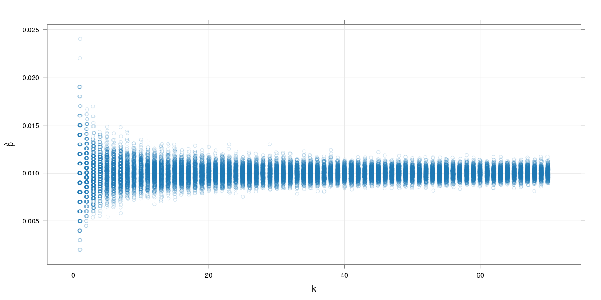
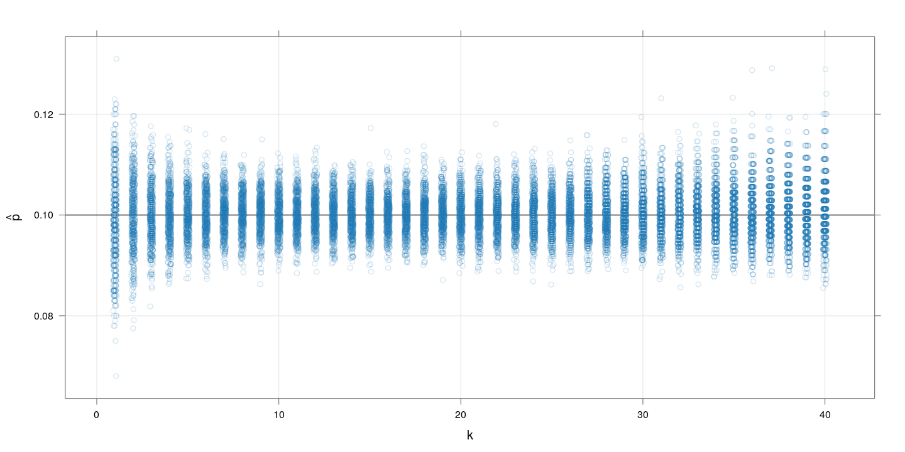
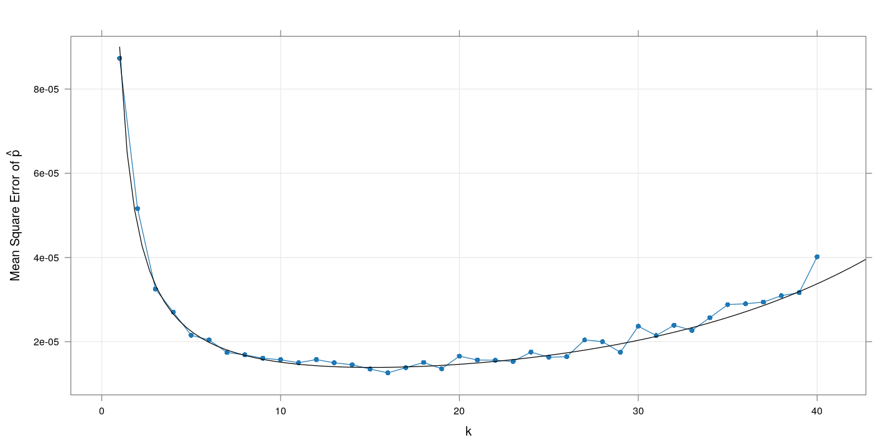
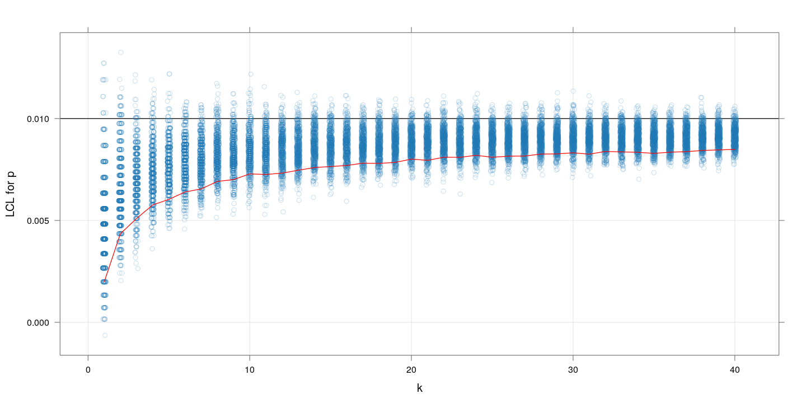

[Here is the [source](pooled-testing.rmd) of this document. Click <a
href="#" data-toggle="collapse" data-target="div.sourceCode"
aria-expanded="true">here</a> to show / hide the R code used. ]


# Background

To estimate the prevalence of the COVID-19 virus in a given
population, a simple strategy would be to take a random sample and
test everyone. Usually the cost of sampling is proportional to the
number of individuals in the sample. However, in the current scenario,
there are two different cost aspects: sample collection and the actual
testing.  Given the limited availability of test kits / reagents, a
possible strategy is to combine several individual samples (swabs) and
test them together.

The following analysis assumes a very simple setup: that the cost of
collecting samples (swabs) is negligible, but the cost of testing is
not. In practice, the considerations will be more complex, but the
same ideas should go through.


# Estimation

Assuming that samples (swabs) are randomly mixed before being tested,
the estimation calculations are fairly simple. Suppose that 

- $$m$$ is the total number of tests that are to be performed (depends
  on available resources).
  
- \\(k\\) is the number of samples (swabs) combined in each test.

- $n = mk$ is thus the total number of individuals sampled.

Here the idea is that $m$ is fixed by resource constraints, but $k$
(hence $n$) can be chosen to be anything. The goal is to choose $k$
using some statistical optimality criterion.

Suppose the true proportion of positive cases in the population is
$p$. Then the probability that each test sample (combining $k$
randomly sampled individuals) is "positive" is 
$$
q = 1 - (1-p)^k \implies p = 1 - (1-q)^{(1/k)}
$$
Assuming that the test is perfect (no false positives or false
negatives), the total number $T$ of positive tests has a Binomial
distribution:
\[
T \sim Bin(m, q)
\]
The obvious point estimates then are

- \(\hat{q} = T / m\)

- $\hat{p} = 1 - (1-\hat{q})^{(1/k)}$

$\hat{q}$ is unbiased for $q$ and has a variance of $q(1-q)/n$. Using
the Delta Method, it follows that $\hat{p}$ is also asymptotically
unbiased (for large $m$) with a variance of 
$$
\frac{1 - (1-p)^k}{mk^2} (1-p)^{(2-k)}
$$


# Simulation

Ideally, we want to choose $k$ such that $\hat{p}$ is closest to the
true $p$. This will of course depend on $p$. The following simulations
fix the values of $m$ and $p$, and explores the effect of varying $k$.

## $m=1000, p=0.01$

The following plot shows simulated $\hat{p}$ values for $k$ runnning
from 1 to 70, with 500 replcations for each $k$.


```r
M <- 1000
P <- 0.01
g <- expand.grid(m = M, k = 1:70, p = P, rep = 1:500)
g <- within(g,
            {
                t <- rbinom(nrow(g), size = m, prob = 1 - (1-p)^k)
                qhat <- t / m
                phat <- 1 - (1-qhat)^(1/k)
            })
xyplot(phat ~ k, data = g, jitter.x = TRUE, grid = TRUE, alpha = 0.2,
       abline = list(h = P), ylab = expression(hat(p)))
```




Clearly, increasing $k$ improves the precision of $\hat{p}$, although
the marginal benefit of increasing $k$ is negligible after a
while. 

The following plot shows the (simulation) mean squared error (in
estimating $p$) for each $k$, and compares with the explicitly
computed variance given above (the black line).


```r
xyplot(tapply((phat - p)^2, k, mean) ~ tapply(k, k, unique),
       data = g, grid = TRUE, type = "o", pch = 16,
       xlab = "k",
       ylab = expression("Mean Square Error of " * hat(p))) +
    layer_(panel.curve((1 - (1-P)^x) * (1-P)^(2-x) / (M*x^2), from = 1))
```


This confirms our visual impression that increasing $k$ is useful, and
that the explicit caculation matches what we see in simulation.


## $m=1000, p=0.1$

The following plot again shows simulated $\hat{p}$ values for $k$
runnning from 1 to 70, with 500 replcations for each $k$. This time,
$p$ is substantially higher at $0.1$.


```r
M <- 1000
P <- 0.1
g <- expand.grid(m = M, k = 1:70, p = P, rep = 1:500)
g <- within(g,
            {
                t <- rbinom(nrow(g), size = m, prob = 1 - (1-p)^k)
                qhat <- t / m
                phat <- 1 - (1-qhat)^(1/k)
            })
xyplot(phat ~ k, data = g, jitter.x = TRUE, grid = TRUE, alpha = 0.2,
       abline = list(h = P), ylab = expression(hat(p)))
```


The problem here is that when combining too many samples, the per-test
positive probability becomes too high, and often _all_ the $m$ tests
turn positive. For example, with $k=50$ and $p=0.1$, the value of
$q$ is 0.9948.


Restricting to $k \leq 40$ and omitting the cases where $\hat{p} = 1$,
we get:


```r
xyplot(phat ~ k, data = g, jitter.x = TRUE, grid = TRUE, alpha = 0.2,
       subset = (k <= 40) & (phat < 1),
       abline = list(h = P), ylab = expression(hat(p)))
```



Here, increasing $k$ improves the precision of $\hat{p}$ up to a
point, after which it decreases again. 

The plot of the corresponding (empirical and theoretical) mean squared
error suggests an optimal range of $k$ between 10 and 20.


```r
xyplot(tapply((phat - p)^2, k, mean) ~ tapply(k, k, unique),
       data = g, grid = TRUE, type = "o", pch = 16,
       subset = (k <= 40) & (phat < 1),
       xlab = "k",
       ylab = expression("Mean Square Error of " * hat(p))) +
    layer(panel.curve((1 - (1-P)^x) * (1-P)^(2-x) / (M*x^2), from = 1))
```



# Take-home message


The actual optimization problem will have to be formulated depending
on the practical constraints. But ultimately it boils down to choosing
an optimal value of $k$ and $m$ given other constraints, and the
following observations will hold generally:

1. The optimal choices of $k$ and $m$ will depend on the true unknown
   $p$ (so they will have to be chosen based on some guess about $p$).

2. For a given $p$, the mean-squared-error (MSE) of $\hat{p}$ is as
   good a criterion to minimize as anything else (although it might
   not be the best criterion when comparing different values of $p$).

3. The explicit expression for the mean squared error, although valid
   only asymptotically, seems to be in good agreement with simulated
   results. This makes the optimization exercise fairly simple.
   
4. Simulation is still a useful tool to anticipate extreme behaviour
   not reflected by the mean squared error alone (such as $q$ becoming
   too high).


Of course, we will not know $p$ in advance, and $p$ will also change
over time as the infection spreads. Generally speaking, taking a
fairly high $k$ (maybe around 30) would seem reasonable for a pilot
study, with further refinements in subsequent rounds.


# Confidence limits

Although not directly relevant for choosing $k$ and $m$, it is
important to consider confidence limits rather than point estimates
when trying to estimate $p$. In this scenario, it is more important to
have a lower confidence limit than an upper confidence limit
(overestimating $p$ is not a big problem, but underestimating it could
be). It is common to consider an approximate (Gaussian) lower
confidence limit. An "exact" limit is also possible, although it is
slightly slower to compute.

An R implementation of both are given for reference (Click <a href="#"
data-toggle="collapse" data-target="div.sourceCode"
aria-expanded="true">here</a> to show / hide code.)


```r
normal.lcl <- function(t, k = 1, m = 100, level = 0.95)
{
    ## Approximate (Gaussian) confidence interval for p when
    ## - k swabs tested in each group
    ## - m such groups (for a total of n=k*m individuals sampled)
    qhat <- t / m
    qlo <- t / m + qnorm(1-level) * sqrt(qhat * (1-qhat) / m)
    1 - (1-qlo)^(1/k)
}
exact.lcl <- function(t, k = 1, m = 100, level = 0.95)
{
    ## Exact (binomial) lower confidence limit for p when
    ## - k swabs tested in each group
    ## - m such groups (for a total of n=k*m individuals sampled)
    pval.shifted <- function(p0)
    {
        pbinom(t, m, 1 - (1 - p0)^k, lower.tail = FALSE) - (1-level)
    }
    lcl <- try(uniroot(pval.shifted, c(0, t/m))$root, silent = TRUE)
    if (inherits(lcl, "try-error")) NA else lcl
}
```

# Simulation of lower confidence limits

## $m=1000, p=0.01$

The following plot shows the approximate lower confidence limits in
the same setup as above (but with $k$ only up to 40). The red line
indicates the (lower) 10th percentile of the LCL values for each
$k$. The "closer" this is to the true value of $p$, the more "precise"
the (random) confidence limit is.


```r
M <- 1000
P <- 0.01
g <- expand.grid(m = M, k = 1:40, p = P, rep = 1:500)
g <- within(g,
            {
                t <- rbinom(nrow(g), size = m, prob = 1 - (1-p)^k)
                lcl.approx <- normal.lcl(t, k = k, m = m, level = 0.95)
            })
xyplot(lcl.approx ~ k, data = g, jitter.x = TRUE, grid = TRUE, alpha = 0.2,
       abline = list(h = P), ylab = expression("LCL for p")) +
    layer(panel.average(x, y, fun = function(x) quantile(x, 0.1),
                        horizontal = FALSE, col = "red"))
```


## $m=1000, p=0.1$

Similar plot for $p=01$. The message is more or less the same as we
saw with the MSE values: $k$ between 10 and 20 gives highest
precision.


```r
M <- 1000
P <- 0.1
g <- expand.grid(m = M, k = 1:40, p = P, rep = 1:500)
g <- within(g,
            {
                t <- rbinom(nrow(g), size = m, prob = 1 - (1-p)^k)
                lcl.approx <- normal.lcl(t, k = k, m = m, level = 0.95)
            })
xyplot(lcl.approx ~ k, data = g, jitter.x = TRUE, grid = TRUE, alpha = 0.2,
       abline = list(h = P), ylab = expression("LCL for p")) +
    layer(panel.average(x, y, fun = function(x) quantile(x, 0.1),
                        horizontal = FALSE, col = "red"))
```



