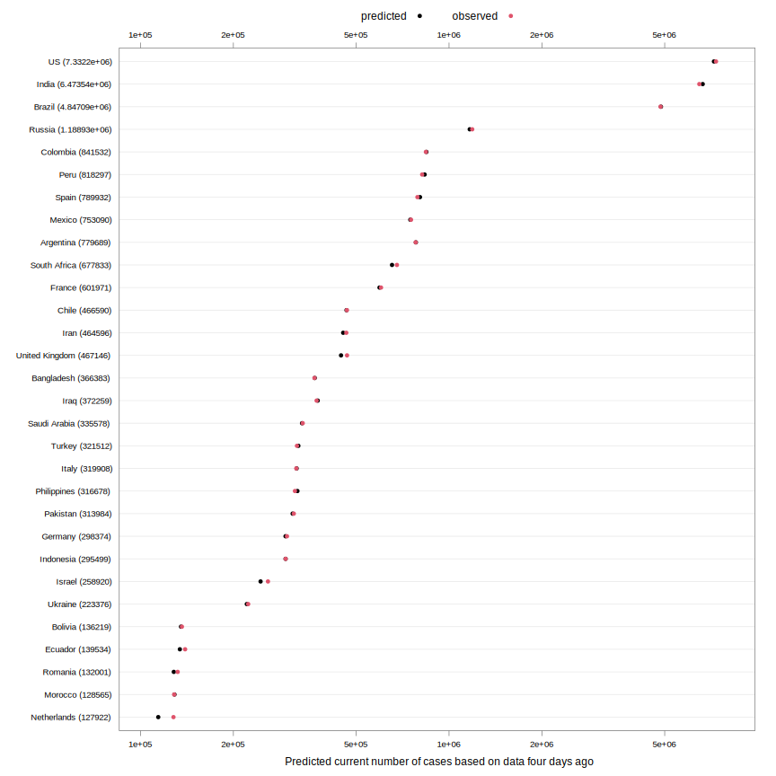
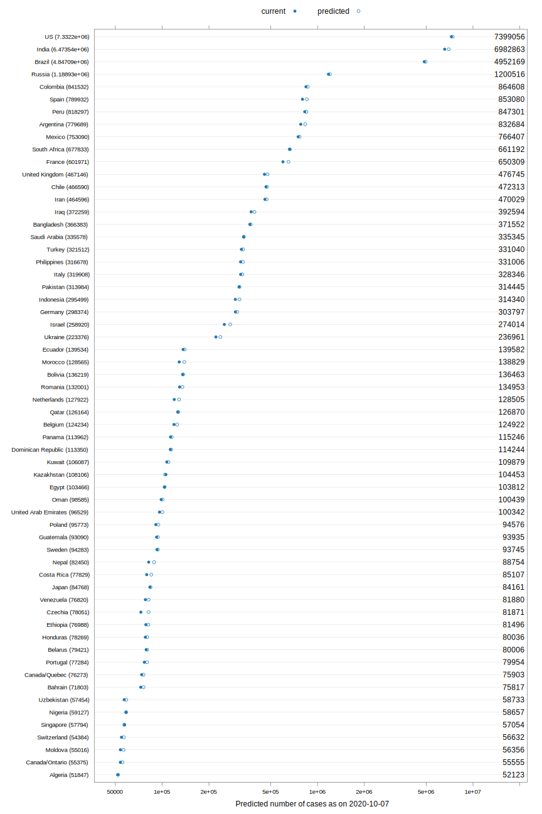
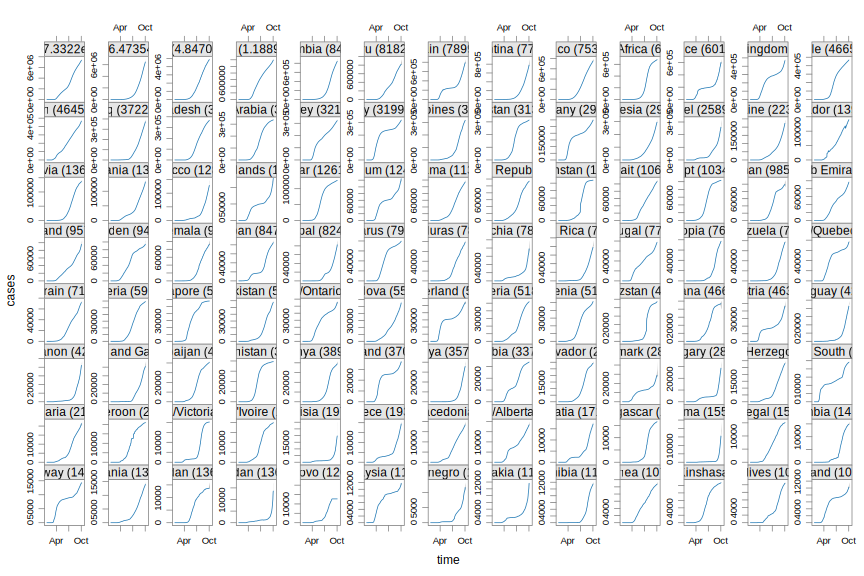

[This note was last updated using data downloaded on 
2020-08-25. Here is the
[source](https://github.com/deepayan/deepayan.github.io/blob/master/covid-19/prediction.rmd) of this analysis. Click <a href="#"
data-toggle="collapse" data-target="div.sourceCode"
aria-expanded="true">here</a> to show / hide the R code used. ]


Prediction is of course
[difficult](https://quoteinvestigator.com/2013/10/20/no-predict/),
especially about the future.

As we see [here](doubling.html), a plot of the case counts today, one
week ago, and two weeks ago gives us a good sense of how different
countries are managing the spread of COVID-19. The following plot is
similar, showing the latest counts, and also shows how much the counts
have increased in the last 4 days, and the 4 days before that. These
are on a logarithmic scale, which means that the 4-day increases are a
measure of the percentage increase; larger means faster rate of
growth.


```r
total.row <- apply(xcovid.row, 2, tail, 1)
total.row.1 <- apply(xcovid.row, 2, function(x) tail(x, 5)[1])
total.row.2 <- apply(xcovid.row, 2, function(x) tail(x, 9)[1])
torder <- tail(order(total.row), 60)
dotplot(total.row[torder], total.1 = total.row.1[torder], total.2 = total.row.2[torder],
        xlab = "Total cases (NOTE: log scale)",
        xlim = c(100, NA),
        panel = function(x, y, ..., total.1, total.2, col) {
            col <- trellis.par.get("superpose.line")$col
            dot.line <- trellis.par.get("dot.line")
            panel.abline(h = unique(y), col = dot.line$col, lwd = dot.line$lwd)
            panel.segments(log10(total.2), y, log10(total.1), y, col = col[3], lwd = 2)
            panel.segments(log10(total.1), y, x, y, col = col[2], lwd = 3)
            panel.points(x, y, pch = 16, col = col[1])
        },
        scales = list(x = list(alternating = 3, log = 10, equispaced.log = FALSE)))
```


We can use this for a crude prediction of the number of cases 4 days
further on, by assuming that on the log scale, the "increase" changes
(actually decreases, one hopes) in a geometric progression. The
countries are sorted according to their case counts 4 days ago. 


```r
predictCases <- function(x, days = 7, go.back = TRUE, smooth = TRUE)
    ## go.back = TRUE: use -days, -2*days to predict current
    ## go.back = FALSE: use -days, current to predict +days
    ## smooth: use loess() to smooth noise in data 
{
    u <- if (go.back) head(x, -days) else x # used for prediction
    N <- nrow(u)
    if (smooth)
        u <- apply(u, 2,
                   function(v) predict(loess(v ~ seq_len(N),
                                             span = 0.35)))
    if (N - 2 * days > nrow(x)) stop("Not enough data")
    if (any(u[N - 2 * days, ] <= 0))
    {
        warning(sprintf("dropping zero counts at %g days", N - 2 * days))
        keep <- u[N - 2 * days, ] > 0
        u <- u[, keep, drop = FALSE]
        x <- x[, keep, drop = FALSE]
    }
    total.0 <- u[N, , drop = TRUE]
    total.1 <- u[N - days, , drop = TRUE]
    total.2 <- u[N - 2 * days, , drop = TRUE]
    ## predict assuming linear change in diff(log(count))
    d2 <- log(total.1) - log(total.2)
    d1 <- log(total.0) - log(total.1)
    ## assume these are in geometric progression
    ## d0 <- d1 * d1 / d2
    ## or assume these are in arithmetic progression (can go negative)
    d0 <- 2 * d1 - d2
    total.predict <- exp(log(total.0) + d0)
    total.observed <- if (go.back) x[N + days, , drop = TRUE] else NA
    data.frame(region = colnames(x),
               total2 = total.2,
               total1 = total.1,
               total0 = total.0,
               predicted = total.predict,
               observed = total.observed)
}
```

This is how well these predictions performed when applied on data from
4 days ago to predict the current counts (for the 30 countries with
highest current count). The predictions are sometimes bad when counts
are low (not surprisingly), but generally reasonable.


```r
torder <- tail(order(total.row), 30)
pred.past <- predictCases(xcovid.row[, torder, drop = FALSE], days = 4, go.back = TRUE)
dotplot(reorder(region, total0) ~ predicted + observed, data = pred.past,
        xlab = "Predicted current number of cases based on data four days ago",
        par.settings = simpleTheme(pch = 16, col = c(1, 2)), auto.key = list(columns = 2),
        scales = list(x = list(alternating = 3, log = TRUE, equispaced.log = FALSE)))
```



Here are the predictions 4 days into the future (
2020-08-29
) using current data.


```r
torder <- tail(order(total.row), 60)
pred.current <- predictCases(xcovid.row[, torder, drop = FALSE], days = 4, go.back = FALSE)
plot.col <- trellis.par.get("plot.symbol")$col
with(pred.current,
     dotplot(reorder(region, predicted) ~ total0,
             predicted = predicted,
             xlab = sprintf("Predicted number of cases as on %s",
                            as.Date(file.mtime(TARGET)) + 4),
             xlim = c(NA, exp(1.07 * max(log(predicted)))),
             par.settings = simpleTheme(pch = c(16, 1), col = plot.col), 
             panel = function(x, y, ..., predicted) {
                 dot.line <- trellis.par.get("dot.line")
                 panel.abline(h = unique(y), col = dot.line$col, lwd = dot.line$lwd)
                 panel.points(x, y, ...)
                 panel.points(log10(predicted), y, pch = 1, ...)
                 panel.text(current.panel.limits()$xlim[2],
                            y, labels = round(predicted), pos = 2)
             },
             auto.key = list(columns = 2, text = c("current", "predicted")),
             scales = list(x = list(log = 10, equispaced.log = FALSE))))
```




<!--  

# Prediction using doubling time

[TODO]

A slightly more sophisticated method could be to predict the [doubling
time](doubling.html), and use it to predict growth. Although the
initial growth is often erratic, most countries seem to be settling
down into a pattern of linear growth of the doubling time. If we
assume that doubling time will continue to grow linearly, that gives
us a predicted doubling time every day into the future, and that can
be turned into a predicted number of cases (or new cases, etc.).


```r
DAYS.USED <- 5
```

We use a naive method to estimate how the doubling time will change
linearly: we look at the change in doubling time over the last 
5 days, and use the minimum and maximum as possible
limits.


```cpp
#include <Rcpp.h>

using namespace Rcpp;

double interpolate_value(NumericVector x, double thalf)
{
    int lo, hi;
    // should be error if thalf < 0; but just return 0
    if (thalf < 0) return 0.0;
    lo = (int) thalf;
    hi = lo + 1;
    return x[lo] * (hi-thalf) + x[hi] * (thalf-lo);
}


// [[Rcpp::export]]
NumericVector extend_linear_doubling(NumericVector x, int nnew,
				     double dcurrent, double dchange)
{
    int j, n = x.size();
    double thalf;
    NumericVector ex(n + nnew);
    for (int j = 0; j < n; j++) {
		ex[j] = x[j];
    }
    for (int j = n; j < n + nnew; j++) {
		dcurrent += dchange;
		thalf = j - dcurrent;
		ex[j] = 2 * interpolate_value(ex, thalf);
    }
    return ex;
}
```


```r
tdouble <- function(n, x, min = 50)
{
    if (x[n] < min) return (NA_real_)
    x <- head(x, n)
    x <- c(0, x[x > 0])
    i <- seq_along(x)
    f <- approxfun(x, i)
    diff(f(max(x) * c(0.5, 1)))
}
doubling.last <- function(x, min = 50, days = DAYS.USED)
{
    sapply(rev(seq(length(x), by = -1, length.out = days)),
           tdouble, x = x, min = min)
}
panel.predict <-
    function(x, y, drop.days = 0, pred.days = DAYS.USED, new.days = 20,
             cumulative = TRUE, fill = "grey50", alpha = 0.5,
             prepanel = FALSE)
        ## daily new cases (diff) if cumulative = FALSE
{
    if (drop.days > 0)
    {
        x <- head(x, -drop.days)
        y <- head(y, -drop.days)
    }
    N <- length(x)
    dt <- doubling.last(y, min = 50, days = pred.days)
    drange <- range(diff(dt))
    ## prediction for lower and upper end: next 'new.days' days
    y.lower <-
        tail(extend_linear_doubling(y, new.days, dt[length(dt)], max(0, drange[1])),
             new.days + 1)
    y.upper <-
        tail(extend_linear_doubling(y, new.days, dt[length(dt)], drange[2]),
             new.days + 1)
    x.new <- seq(x[N], by = 1, length.out = new.days + 1)
    ## str(list(N = N, ystart = y[N], x = x.new, yl = y.lower, yu = y.upper))
    if (prepanel)
    {
        if (cumulative) list(xlim = range(x) + c(0, new.days),
                             ylim = c(NA, max(y.lower, y.upper)))
        else list(xlim = range(x) + c(0, new.days),
                  ylim = c(NA, max(diff(y.lower), diff(y.upper))))
    }
    else
    {
        if (cumulative)
            panel.polygon(c(x.new, rev(x.new)), c(y.lower, rev(y.upper)),
                          col = fill, alpha = alpha, border = "transparent")
        else
            panel.polygon(x.new[-1], diff(y.lower), rev(x.new[-1]), rev(diff(y.upper)),
                          col = fill, alpha = alpha, border = "transparent")
    }
}
my.prepanel <- function(x, y, ..., new.days, cumulative = TRUE)
{
    panel.predict(x, y, ...,
                  new.days = new.days,
                  cumulative = cumulative, prepanel = TRUE)
}
my.panel <- function(x, y, ..., new.days, cumulative)
{
    panel.predict(x, y, ...,
                  new.days = new.days,
                  cumulative = cumulative, alpha = 0.5)
    if (cumulative)
        panel.xyplot(x, y, ..., type = "l")
    else
        panel.xyplot(x[-1], diff(y), ..., type = "o", pch = ".", cex = 3)
}
```


```r
N <- nrow(xcovid.row)
regions <- # at least 1000 cases
    names(which(sort(xcovid.row[N, ], decreasing=TRUE) > 9999))
t <- seq(as.Date("2020-01-22"), by = 1, length.out = N)
d.regions <- data.frame(time = t,
                        cases = as.vector(xcovid.row[, regions]),
                        region = gl(length(regions), N, labels = regions))
xyplot(cases ~ time | region, data = d.regions, 
       new.days = 10, cumulative = TRUE, as.table = TRUE,
       drop.days = DAYS.USED, pred.days = DAYS.USED,
       scales = list(y = "free"),
       prepanel = my.prepanel, panel = my.panel)
```




-->
