```r
TARGET.cases <- "time_series_covid19_confirmed_US.csv"
TARGET.deaths <- "time_series_covid19_deaths_US.csv"
SURL <- "https://github.com/CSSEGISandData/COVID-19/raw/master/csse_covid_19_data/csse_covid_19_time_series"
## To download the latest version, delete the files and run again
for (target in c(TARGET.cases, TARGET.deaths))
{
	if (!file.exists(target))
        download.file(sprintf("%s/%s", SURL, target), destfile = target)
}
```


[This note was last updated using data downloaded on 
2020-04-19. Here is the
[source](us-states.rmd) of this analysis. Click <a href="#"
data-toggle="collapse" data-target="div.sourceCode"
aria-expanded="true">here</a> to show / hide the R code used. ]


```r
covid.cases <- read.csv(TARGET.cases, check.names = FALSE, stringsAsFactors = FALSE)
covid.deaths <- read.csv(TARGET.deaths, check.names = FALSE, stringsAsFactors = FALSE)
if (!identical(colnames(covid.cases), colnames(covid.deaths)))
{
    warning("Cases and death data have different columns (dates)... using common ones.")
    common.colnames <- intersect(colnames(covid.deaths), colnames(covid.cases))
    covid.deaths <- covid.deaths[colnames(covid.deaths) %in% common.colnames]
    covid.cases <- covid.cases[colnames(covid.cases) %in% common.colnames]
}
```

```
Warning: Cases and death data have different columns (dates)... using
common ones.
```

```r
if (!identical(rownames(covid.cases), rownames(covid.deaths)))
{
    stop("Cases and death data have different rows... check versions.")
}
omit.regions <- c("Diamond Princess", "Grand Princess")
covid.deaths <- subset(covid.deaths, !(Province_State %in% omit.regions))
covid.cases <- subset(covid.cases, !(Province_State %in% omit.regions))
```


```r
correctLag <- function(x)
{
    n <- length(x)
    stopifnot(n > 2)
    for (i in seq(2, n-1))
        if (x[i] == x[i-1])
            x[i] <- sqrt(x[i-1] * x[i+1])
    x
}
extractCasesTS <- function(d)
{
    x <- t(data.matrix(d[, -c(1:11)]))
    x[x == -1] <- NA
    colnames(x) <- with(d, paste(Province_State, Admin2, sep = " / "))
    apply(x, 2, correctLag)
}
tdouble <- function(x)
{
    if (all(x == 0)) return (NA)
    x <- c(0, x[x > 0])
    i <- seq_along(x)
    f <- approxfun(x, i)
    diff(f(max(x) * c(0.5, 1)))
}
```

## By state


```r
## State-wise totals
byState.cases <- split(covid.cases, covid.cases$Province_State)
byState.deaths <- split(covid.deaths, covid.deaths$Province_State)
state.cases <- sapply(byState.cases, function(d) colSums(data.matrix(d[, -c(1:11)])))
state.deaths <- sapply(byState.deaths, function(d) colSums(data.matrix(d[, -c(1:11)])))
D <- nrow(state.cases)
```


The following plot shows the current doubling time for deaths and
cases, across US states, with states sorted by the total number of
deaths.


```r
stotal.deaths <- state.deaths[D, , drop = TRUE]
stotal.cases <- state.cases[D, , drop = TRUE]
sdt.deaths <- apply(state.deaths, 2, tdouble)
sdt.cases <- apply(state.cases, 2, tdouble)
state.names <- names(sdt.deaths)
state.names <- factor(state.names, levels = state.names,
                      labels = sprintf("%s (%g)", state.names, stotal.deaths))
dotplot(reorder(state.names, stotal.deaths) ~ sdt.deaths + sdt.cases,
        scales = list(alternating = 3), xlab = "Doubling time in days",
        par.settings = simpleTheme(pch = 16),
        auto.key = list(space = "right", text = c("Deaths", "Cases")))
```

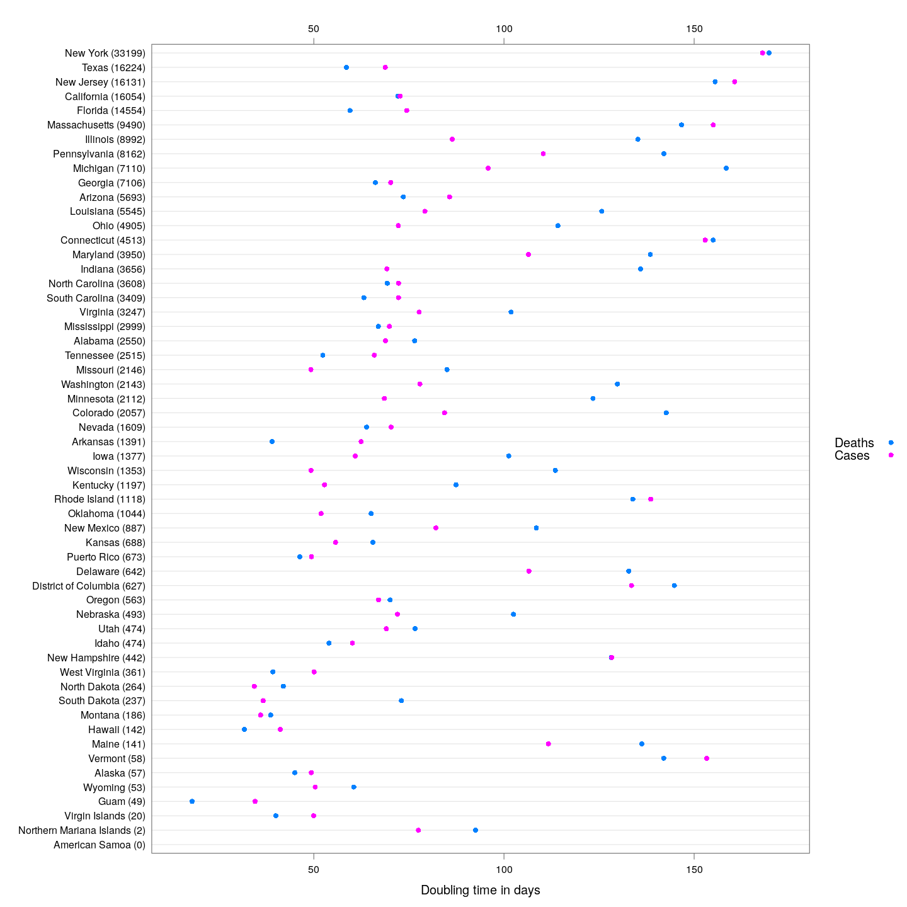


Generally speaking, the doubling times for cases are higher than that
for days. This is a good indicator: as deaths lag behind cases, we can
expect that around a week from now, the doubling time for deaths will
increase to make up the difference.


The following states are somewhat poor performers in this respect:
they have more than 40 deaths, and the difference in their doubling
times is less that 2 days (although Washington is doing pretty well in
terms of the absolute doubling times).


```r
dotplot(reorder(state.names, sdt.cases - sdt.deaths) ~ sdt.deaths + sdt.cases,
        subset = (sdt.cases - sdt.deaths < 2 & stotal.deaths > 40),
        scales = list(alternating = 3), xlab = "Doubling time in days",
        par.settings = simpleTheme(pch = 16),
        auto.key = list(space = "right", text = c("Deaths", "Cases")))
```

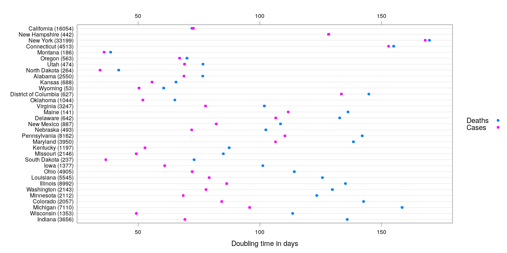

The following plots show how the number of deaths have grown in these
states since the count first exceeded 50, compared to the other
counties.


```r
deathsSince10 <- function(region, xdata)
{
    x <- xdata[, region, drop = TRUE]
    x <- x[x > 10]
    if (length(x) == 0) return (NULL)
    data.frame(region = region, day = seq_along(x),
               deaths = x, total = tail(x, 1))
}
panel.glabel <- function(x, y, group.value, col.symbol, ...) # x,y vectors; group.value scalar
{
    n <- length(x)
    panel.text(x[n], y[n], label = group.value, pos = 4, col = col.symbol, srt = 40)
}
deaths.10 <- do.call(rbind, lapply(colnames(state.deaths), deathsSince10,
                                   xdata = state.deaths))
bg <- xyplot(deaths ~ day, data = deaths.10, grid = TRUE,
             scales = list(alternating = 3, y = list(log = 10, equispaced.log = FALSE)),
             col = "grey", groups = region, type = "l")
fg <- 
    xyplot(deaths ~ day | reorder(region, -total), data = deaths.10,
           xlab = "Days since number of deaths exceeded 10",
           ylab = "Number of deaths", pch = ".", cex = 3, 
           scales = list(alternating = 3, y = list(log = 10, equispaced.log = FALSE)),
           as.table = TRUE, between = list(x = 0.5, y = 0.5), layout = c(4, 5),
           type = "o", ylim = c(NA, 20000))
fg + as.layer(bg, under = TRUE)
```

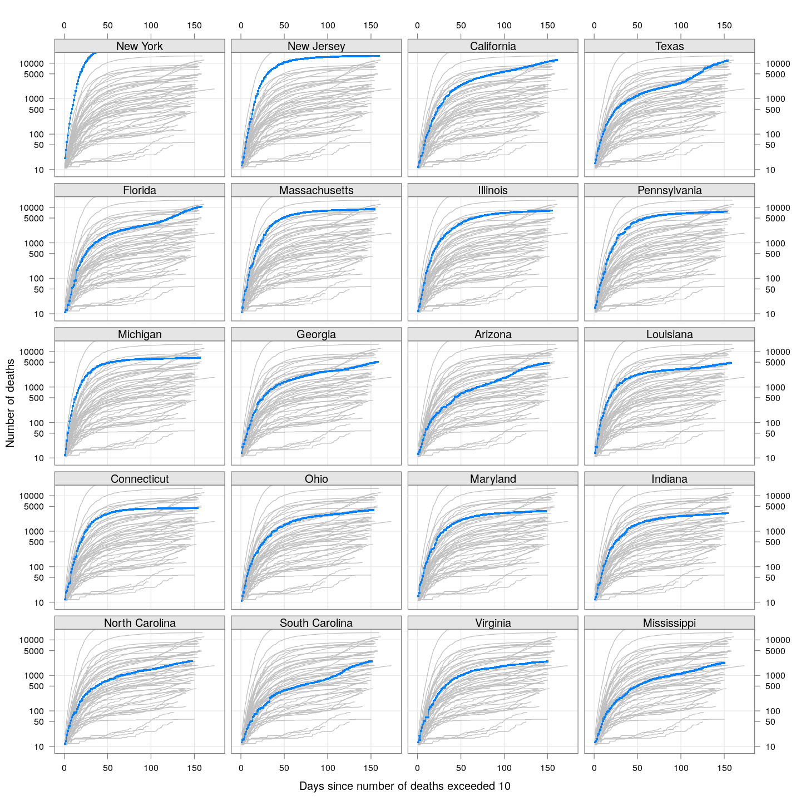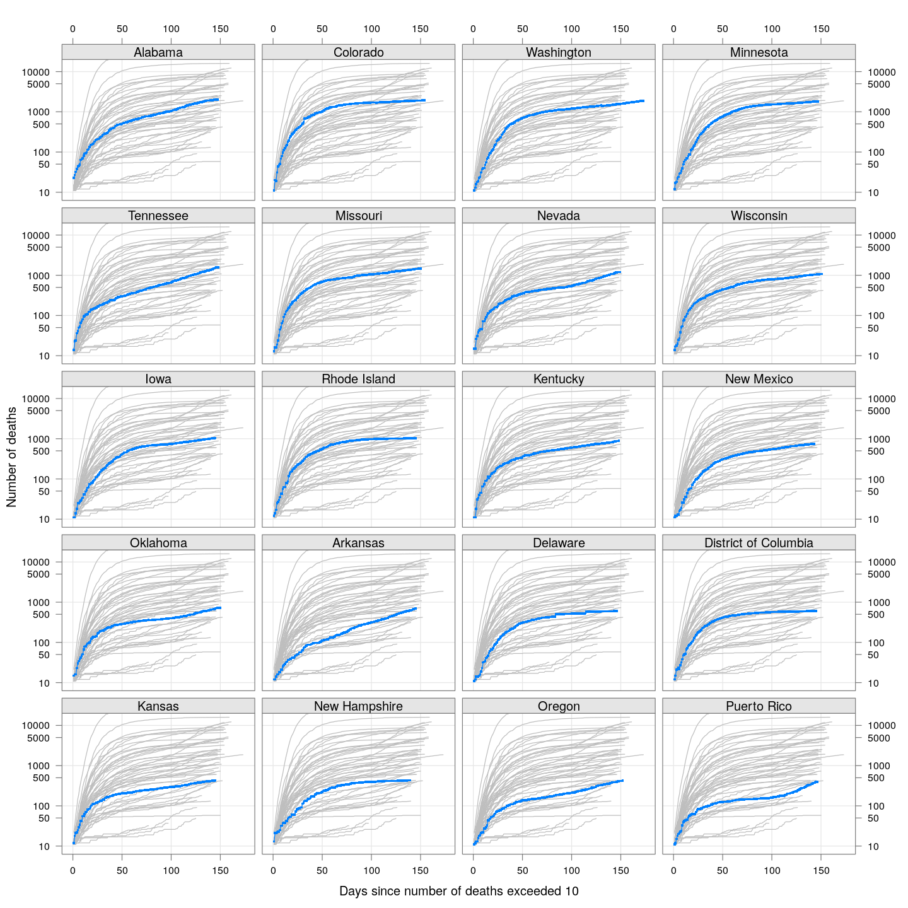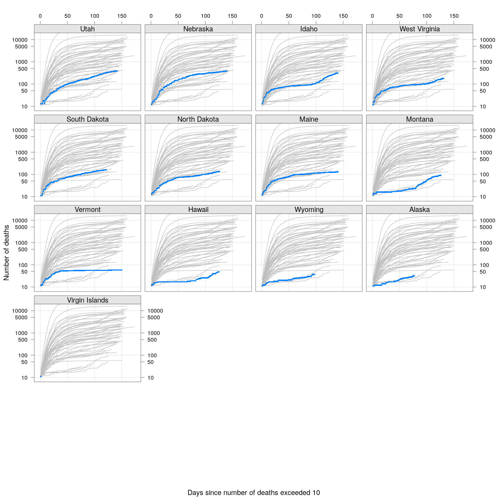


## By county or other administrative region

Most cases are concentrated in some specific counties. The following
plot gives the current doubling time of deaths, compared to total
number of deaths, across US counties / regions with at least 50
deaths.


```r
keep <- covid.deaths[[length(covid.deaths)]] > 50 # at least 50 deaths
covid.cases <- covid.cases[keep, ]
covid.deaths <- covid.deaths[keep, ]
xcovid.cases <- extractCasesTS(covid.cases)
xcovid.deaths <- extractCasesTS(covid.deaths)
D <- nrow(xcovid.deaths)
total.deaths <- xcovid.deaths[D, , drop = TRUE]
dt.deaths <- apply(xcovid.deaths, 2, tdouble)
do.label.1 <- dt.deaths < 2 | dt.deaths > 11
do.label.2 <- total.deaths > 1000
xyplot(dt.deaths ~ total.deaths, pch = 16, grid = TRUE,
       ylab = "Doubling time in days", xlab = "Number of deaths",
       scales = list(alternating = 3, x = list(log = 10, equispaced.log = FALSE))) +
    layer(panel.text(x[do.label.1], y[do.label.1],
                     labels = names(total.deaths)[do.label.1],
                     pos = 4, col = "grey30")) + 
    layer(panel.text(x[do.label.2], y[do.label.2],
                     labels = names(total.deaths)[do.label.2],
                     pos = 2, col = "grey30"))
```

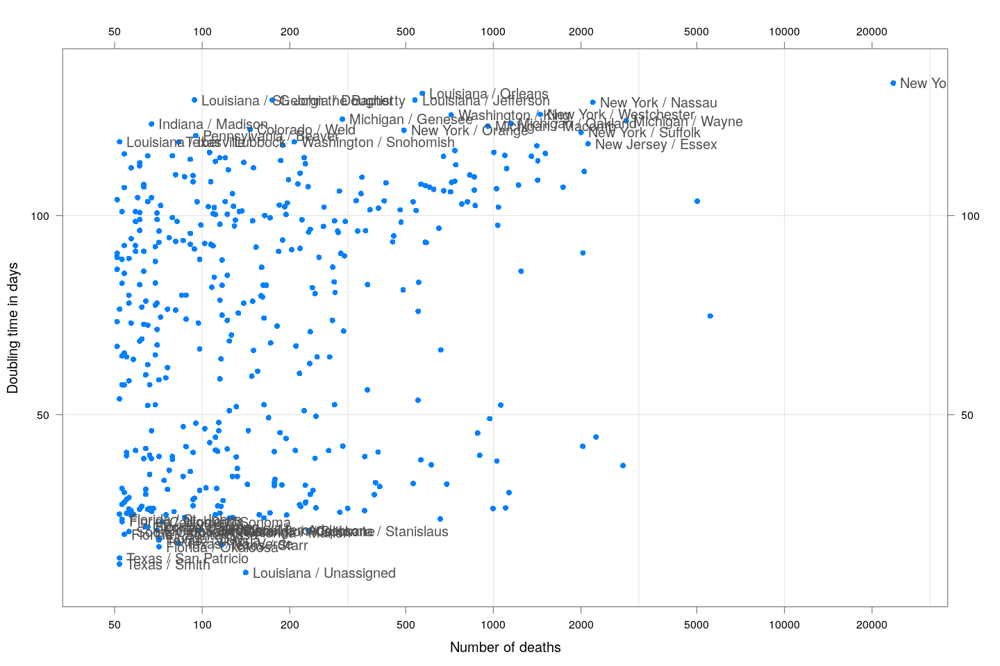


The following plots show how the number of deaths have grown in these
counties since the count first exceeded 50, compared to the other
counties.


```r
deaths.10 <- do.call(rbind, lapply(colnames(xcovid.deaths), deathsSince10,
                                   xdata = xcovid.deaths))
bg <- xyplot(deaths ~ day, data = deaths.10, grid = TRUE,
             scales = list(alternating = 3, y = list(log = 10, equispaced.log = FALSE)),
             col = "grey", groups = region, type = "l")
fg <- 
    xyplot(deaths ~ day | reorder(region, -total), data = deaths.10,
           xlab = "Days since number of deaths exceeded 10",
           ylab = "Number of deaths", pch = ".", cex = 3, 
           scales = list(alternating = 3, y = list(log = 10, equispaced.log = FALSE)),
           as.table = TRUE, between = list(x = 0.5, y = 0.5), layout = c(4, 5),
           type = "o", ylim = c(NA, 20000))
fg + as.layer(bg, under = TRUE)
```

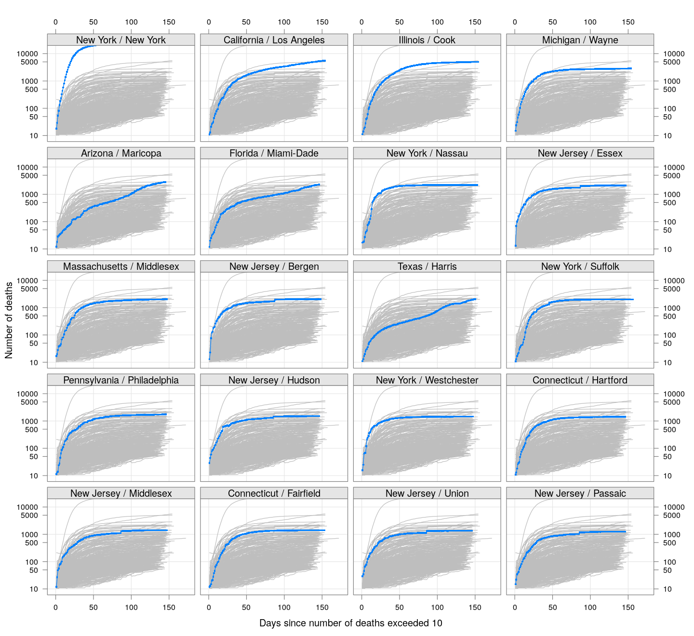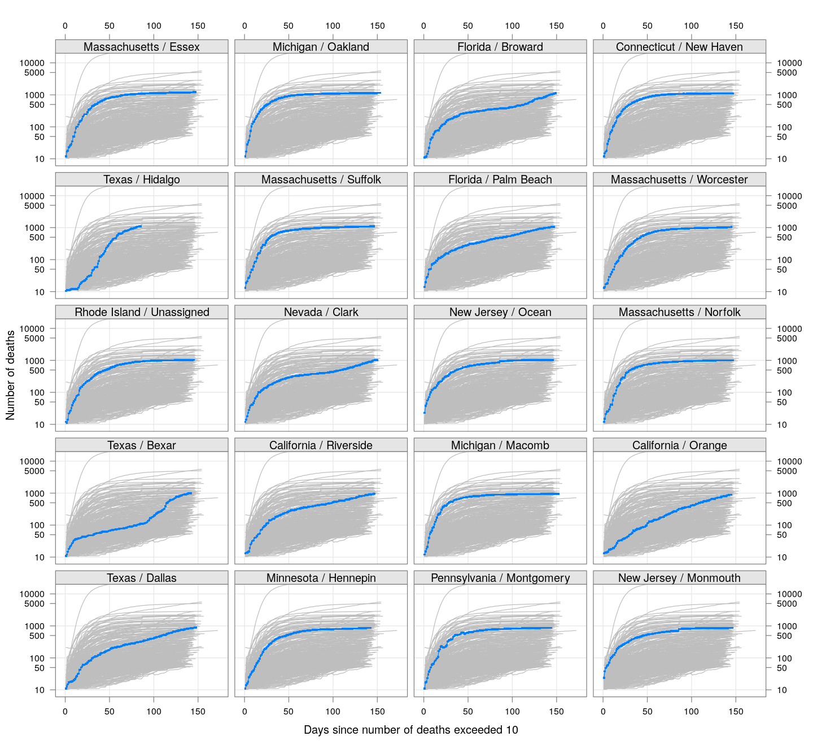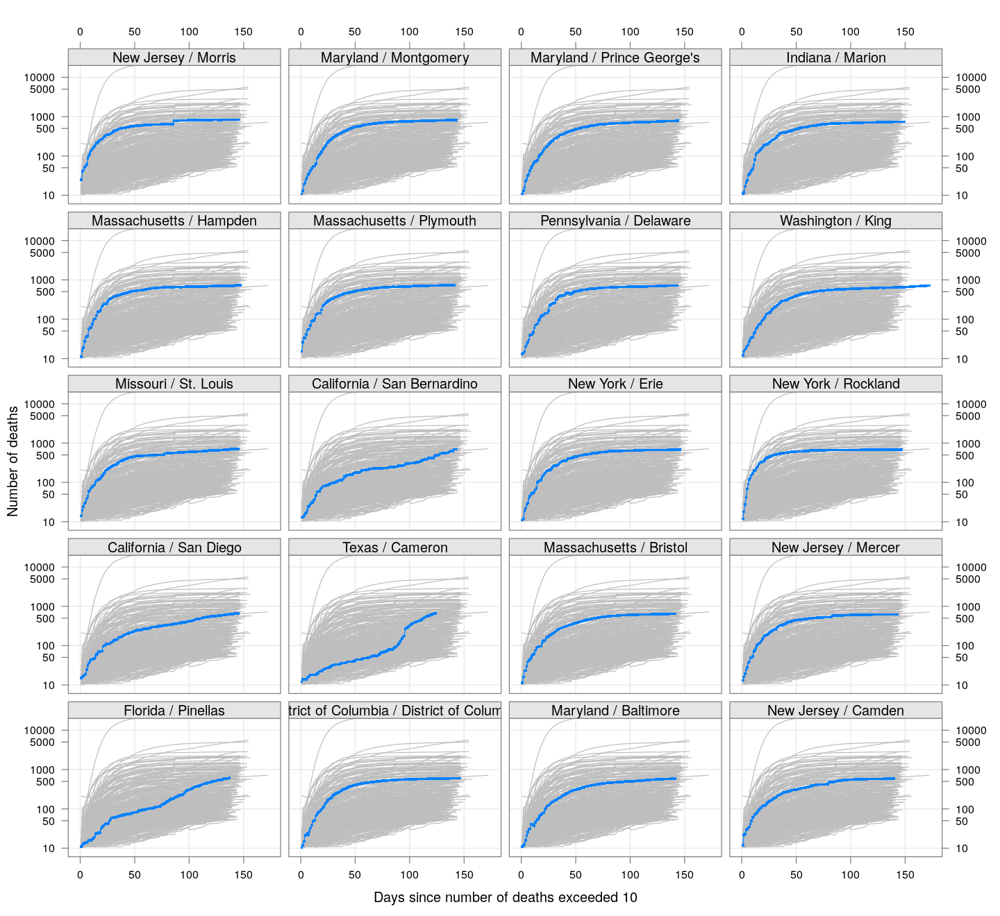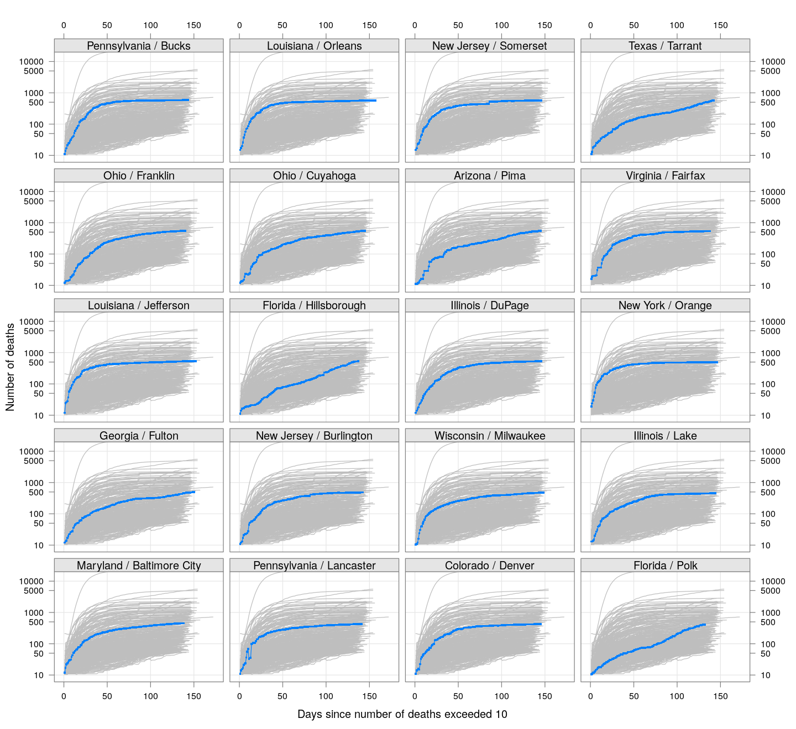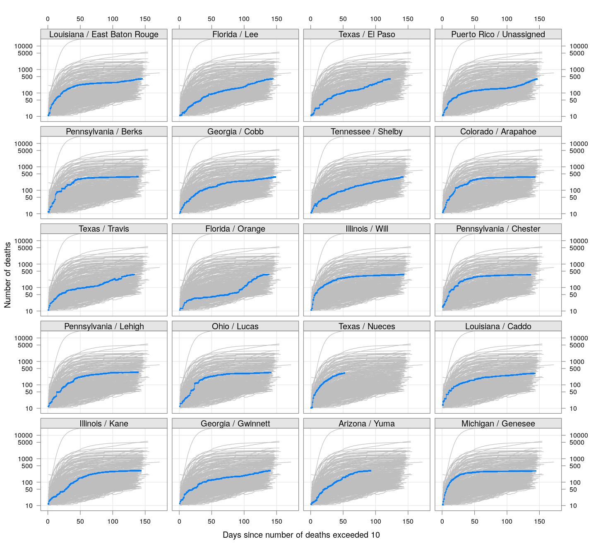

