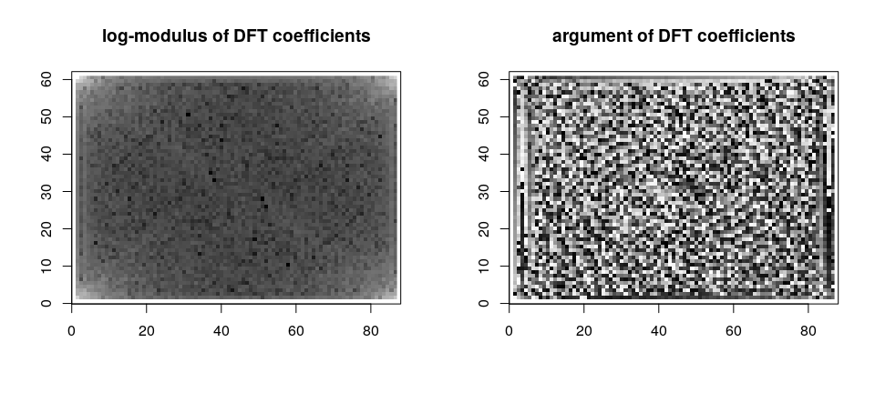
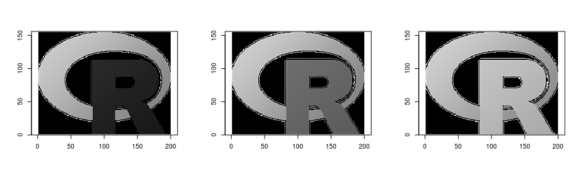
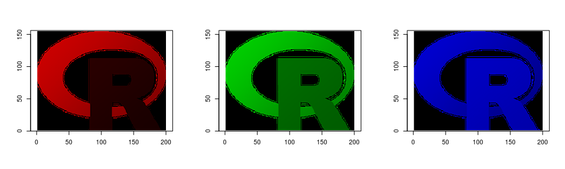
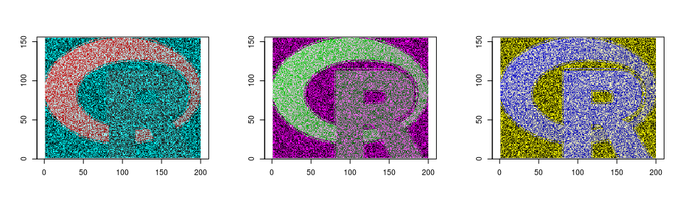
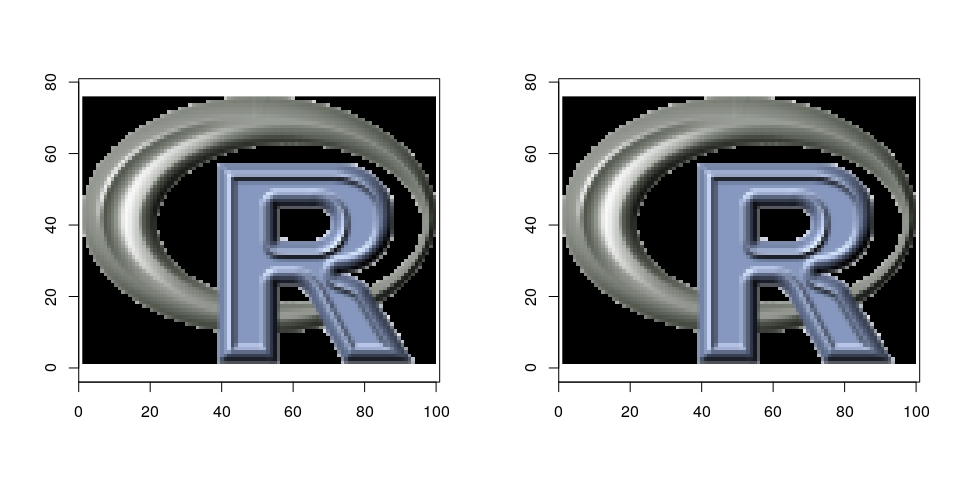
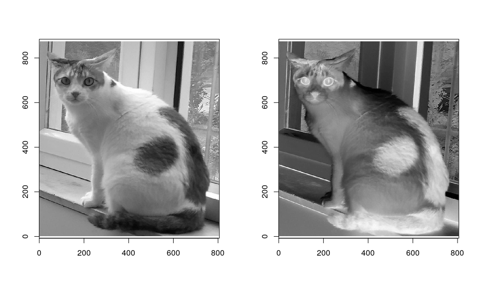
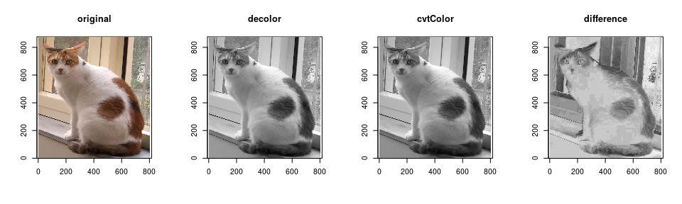
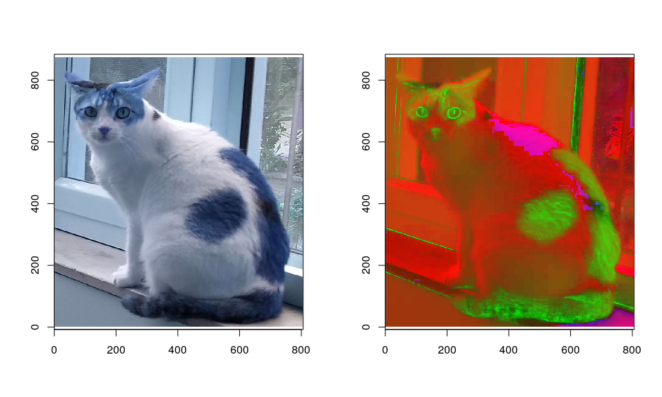
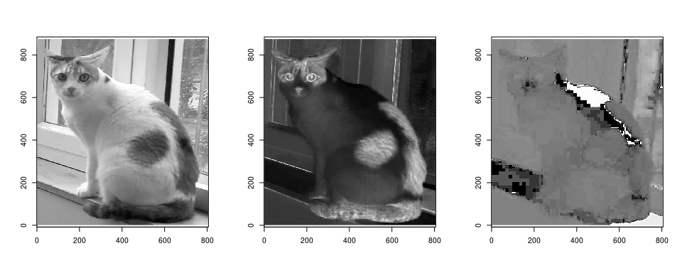
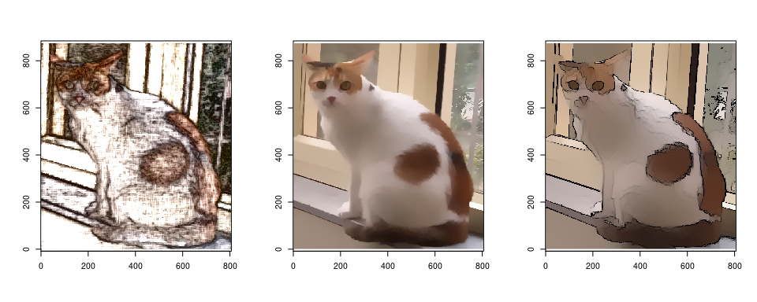

# Introduction

The
[`rip.opencv`](https://github.com/deepayan/rip/tree/main/rip.opencv)
package provides access to selected routines in the
[OpenCV](http://opencv.org/) computer vision library. Rather than
exposing OpenCV classes and methods directly through external
pointers, the package uses standard R objects to represent
corresponding OpenCV objects, and explicitly converts between the two
forms as necessary. The idea behind this design is that most
operations will be performed in R, and OpenCV is used to simply make
an additional suite of operations available. Depending on use case,
the [opencv](https://github.com/ropensci/opencv) R package may be more
useful for you, and a workflow mixing the two is facilitated by the
image import / export functions in the respective packages.

As of now, the only OpenCV class that has an R analogue is
[`cv::Mat`](https://docs.opencv.org/master/d3/d63/classcv_1_1Mat.html#details),
which can be used to represent an n-dimensional dense numerical
single-channel or multi-channel array. It is used by OpenCV to store
real or complex-valued vectors and matrices, grayscale or color
images, and various other kinds of data. The R analogue of `cv::Mat`
is an S3 class named `"rip"`. Regardless of the number of channels, a
`"rip"` object is stored as a matrix, with the number of channels
recorded in an attribute along with the number of rows and columns.

A `"rip"` object can be created in R, most simply from a numeric (or
complex) matrix.


```r
suppressMessages(library(rip.opencv))
v <- as.rip(t(volcano), channel = 1)
v
```

```
[61 x 87] image with 1 channel(s)
```

```r
class(v)
```

```
[1] "rip"    "matrix"
```

```r
str(v)
```

```
 'rip' num [1:61, 1:87] 100 100 101 101 101 101 101 100 100 100 ...
 - attr(*, "cvdim")= Named num [1:3] 61 87 1
  ..- attr(*, "names")= chr [1:3] "nrow" "ncol" "nchannel"
```

An `image()` method for `"rip"` objects can be used to plot it
(examples below).

None of the above involves calling any OpenCV routines. Suppose we now
want to use the OpenCV function
[cv::dft()](https://docs.opencv.org/master/d2/de8/group__core__array.html#gadd6cf9baf2b8b704a11b5f04aaf4f39d)
to obtain a 2-D Discrete Fourier transform of `v`. This can be done
using the high-level `rip.dft()` function as follows:


```r
V <- rip.dft(v) # uses OpenCV function cv::dft()
V
```

```
[61 x 87] image with 1 channel(s)
```

```r
str(V)
```

```
 'rip' cplx [1:61, 1:87] 690907+0i -53607-11919i -5986+182i ...
 - attr(*, "cvdim")= Named num [1:3] 61 87 1
  ..- attr(*, "names")= chr [1:3] "nrow" "ncol" "nchannel"
```

The return value is again an R matrix containing complex values
wrapped in the `"rip"` class. We can use standard R functions for
further processing.


```r
par(mfrow = c(1, 2))
image(log(Mod(V)), main = "log-modulus of DFT coefficients")
image(Arg(V), main = "argument of DFT coefficients")
```



# Using the `"rip"` object for image manipulation

The most common use of a `"rip"` object is to represent a grayscale or
color image. Grayscale images are essentially matrices, and their
representation as a `"rip"` object is conceptually
straightforward. Color images require multiple channels, and depending
on the color space used, many different representations are
possible. The `"rip"` class uses one particular representation,
corresponding to the default `cv::Mat` representation for color
images: For an n-channel image, rows correspond to rows of the image,
and successive n-tuples of columns represent the n channels
corresponding to each column of the the image (i.e., successive
columns do not represent the same channel).

When plotting a color image using the `image()` function, it is
assumed that the channels represent colors in the RGB color space and
that columns are in the BGR ordering (this is the OpenCV default).

The `rip.import()` function uses the OpenCV function `cv::imread()` to
read image data from a file.


```r
if (!file.exists("Rlogo.png"))
    download.file("https://www.r-project.org/Rlogo.png", destfile = "Rlogo.png")
rlogo <- rip.import("Rlogo.png", type = "color")
rlogo
```

```
[155 x 200] image with 3 channel(s)
```

```r
dim(rlogo)
```

```
[1] 155 600
```

```r
str(rlogo)
```

```
 'rip' num [1:155, 1:600] 0 0 0 0 0 0 0 0 0 0 ...
 - attr(*, "cvdim")= Named num [1:3] 155 200 3
  ..- attr(*, "names")= chr [1:3] "nrow" "ncol" "nchannel"
```

__Note__ that although the image is 155 x 200, the underlying
representation is a 155 x 600 matrix. Extracting and manipulating
individual channels in R is difficult with this representation. To
facilitate such manipulation, the `as.array()` method can convert such
an image into a 3-way array, with the third dimension representing
channels in RGB order by default. By design, no array-like indexing
operators have been defined for `"rip"` objects; vector and
matrix-like indexing yields vectors and matrices, dropping the class
attribute.


```r
a <- as.array(rlogo) # add reverse.rgb = FALSE to retain column order
str(a)
```

```
 num [1:155, 1:200, 1:3] 0 0 0 0 0 0 0 0 0 0 ...
```

Individual channels can now be easily extracted.


```r
par(mfrow = c(1,3))
image(as.rip(a[,,1]))
image(as.rip(a[,,2]))
image(as.rip(a[,,3]))
```



The `as.rip()` function can also handle 3-way arrays as input,
interpreting it as a color image. This allows channels to be
manipulated retaining the array structure before further processing.


```r
par(mfrow = c(1,3))
red   <- a;   red[,,-1] <- 0; image(as.rip(red))
green <- a; green[,,-2] <- 0; image(as.rip(green))
blue  <- a;  blue[,,-3] <- 0; image(as.rip(blue))
```




```r
par(mfrow = c(1,3))
N <- prod(dim(a)[1:2])
  red[,,-1] <- runif(N, 0, 255); image(as.rip(red))
green[,,-2] <- runif(N, 0, 255); image(as.rip(green))
 blue[,,-3] <- runif(N, 0, 255); image(as.rip(blue))
```



Similar methods are also available to convert to and from `"raster"` objects 
(in fact, this is how the `image()` methods works).


```r
r <- as.raster(rlogo)
str(r)
```

```
 'raster' chr [1:155, 1:200] "#000000" "#000000" "#000000" "#000000" ...
```

```r
identical(rlogo, as.rip(r))
```

```
[1] TRUE
```

Images imported using the `png` and `jpeg` packages can also be
converted using suitable `as.rip()` methods.


```r
require(png)
```

```
Loading required package: png
```

```r
f <- system.file("img", "Rlogo.png", package="png")
img <- readPNG(f)
img.n <- readPNG(f, native = TRUE) # "nativeRaster" representation
str(img) # 4-way array
```

```
 num [1:76, 1:100, 1:4] 0 0 0 0 0 0 0 0 0 0 ...
```

```r
str(img.n) # matrix of 32-bit unsigned integers
```

```
 'nativeRaster' int [1:76, 1:100] 0 0 0 0 0 0 0 0 0 0 ...
 - attr(*, "channels")= int 4
```

```r
as.rip(img) # same as as.rip(img.n)
```

```
[76 x 100] image with 4 channel(s)
```

```r
par(mfrow = c(1, 2))
image(as.rip(img))
image(as.rip(img.n))
```



# Modules

The `rip.dft()` and `rip.import()` functions are exceptions rather
than the rule, in the sense that they are two of the very few
high-level functions available in the `rip.opencv` package. Most
functionality is instead exposed through low-level interfaces to
selected OpenCV routines through Rcpp modules. These are not expected
to be called directly by the end-user, and are rather meant to be used
by other packages; careless use may lead to the R session crashing.

All modules in the package are available through the `rip.cv`
variable, which is an environment containing named modules that group
together similar functionality.


```r
ls(rip.cv)
```

```
[1] "core"       "enums"      "feature"    "filter"     "imgproc"   
[6] "IO"         "photo"      "transforms"
```

The grouping is somewhat arbitrary and may change as the package
evolves. For example, the `IO` module contains interfaces to the
`cv::imread()` and `cv::imwrite()` functions, which are also exposed
through the high-level functions `rip.import()` and
`rip.export()`. However, one can also call a function in the module
directly.


```r
rip.cv$IO$imread
```

```
internal C++ function <0x5556b59546e0>
    docstring : Read image from file: type 0=grayscale, 1=color
    signature : Rcpp::Matrix<14, Rcpp::PreserveStorage> imread(std::vector<std::__cxx11::basic_string<char, std::char_traits<char>, std::allocator<char> >, std::allocator<std::__cxx11::basic_string<char, std::char_traits<char>, std::allocator<char> > > >, int)
```

We will use this function to read in a sample image. The result
depends on a "read mode" flag, which is an integer code (the OpenCV
documentation has details) that can be supplied explicitly. Some
selected flags are available as named integer vectors in
`rip.cv$enums`; these are not exhaustive but covers most common use
cases. The following example reads in a color image in grayscale mode.


```r
f <- system.file("sample/color.jpg", package = "rip.opencv", mustWork = TRUE)
(imreadModes <- rip.cv$enums$ImreadModes)
```

```
IMREAD_UNCHANGED IMREAD_GRAYSCALE     IMREAD_COLOR 
              -1                0                1 
```

```r
(x <- rip.cv$IO$imread(f, imreadModes["IMREAD_GRAYSCALE"]))
```

```
[875 x 805] image with 1 channel(s)
```

Once imported, the `"rip"` object can be manipulated as usual.


```r
par(mfrow = c(1, 2))
image(x, rescale = FALSE)
image(255 - x, rescale = FALSE) # negative
```



## Example: convert color image to grayscale

We can of course read in the image in color mode as well.


```r
(x <- rip.cv$IO$imread(f, imreadModes["IMREAD_COLOR"]))
```

```
[875 x 805] image with 3 channel(s)
```

Suppose we now want to convert it into a grayscale image. One way to
do so is to use the `cv::decolor()` function, which implements a
contrast-preserving decolorization algorithm. Another alternative is to use
the `cv::cvtColor()`.


```r
y1 <- rip.cv$photo$decolor(x)
convcodes <- rip.cv$enums$ColorConversionCodes
y2 <- rip.cv$imgproc$cvtColor(x, convcodes["COLOR_BGR2GRAY"])
range(y1 - y2)
```

```
[1] -6 13
```

```r
par(mfrow = c(1, 4))
image(x, rescale = FALSE, main = "original")
image(y1, rescale = FALSE, main = "decolor")
image(y2, rescale = FALSE, main = "cvtColor")
image(y1 - y2, rescale = TRUE, main = "difference")
```



The `cv::cvtColor()` function is designed for more general color space
conversion, and can be used, for example, to go from the default BGR
channel ordering to RGB, or an entirely different colorspace such as
HSV. The `image()` function always assumes BGR or grayscale, so it
will be confused by such changes.


```r
par(mfrow = c(1, 2))
x.rgb <- rip.cv$imgproc$cvtColor(x, convcodes["COLOR_BGR2RGB"])
x.hsv <- rip.cv$imgproc$cvtColor(x, convcodes["COLOR_BGR2HSV"])
image(x.rgb)
image(x.hsv)
```



We can of course extract specific channels using `as.array()` from
these objects; for example, the HSV channels can be plotted separately
as follows.


```r
a <- as.array(x.hsv)
par(mfrow = c(1, 3))
image(as.rip(a[,,1]))
image(as.rip(a[,,2]))
image(as.rip(log1p(a[,,3])))
```



The following are more interesting examples of photographic image
transformations.


```r
par(mfrow = c(1, 3))
image(rip.cv$photo$pencilSketch(x, color = TRUE, 80, 0.1, 0.02), rescale = FALSE)
image(y <- rip.cv$photo$edgePreservingFilter(x, 2L, 60), rescale = FALSE)
image(rip.cv$photo$stylization(y, 60), rescale = FALSE)
```




## Other modules

A full list of currently available modules and the functions in them
can be obtained as follows (FIXME: find better way).


```r
do.call(rbind, lapply(ls(rip.cv), function(m) data.frame(Module = m, Function = .DollarNames(rip.cv[[m]], ""))))
```

```
       Module                      Function
1        core                        PSNR( 
2        core              copyMakeBorder( 
3        core                        flip( 
4        core                      rotate( 
5       enums                   BorderTypes
6       enums                      DftFlags
7       enums            InterpolationFlags
8       enums                   ImreadModes
9       enums          ColorConversionCodes
10      enums                          Misc
11    feature                       Canny( 
12    feature      cornerEigenValsAndVecs( 
13    feature                cornerHarris( 
14    feature           cornerMinEigenVal( 
15     filter                GaussianBlur( 
16     filter                      Scharr( 
17     filter                       Sobel( 
18     filter             bilateralFilter( 
19     filter                        blur( 
20     filter                   boxFilter( 
21     filter                    filter2D( 
22     filter             getDerivKernels( 
23     filter              getGaborKernel( 
24     filter           getGaussianKernel( 
25     filter                  medianBlur( 
26     filter                 sepFilter2D( 
27    imgproc                    cvtColor( 
28    imgproc                      dilate( 
29    imgproc                equalizeHist( 
30    imgproc                       erode( 
31    imgproc               getRectSubPix( 
32    imgproc         getRotationMatrix2D( 
33    imgproc       getStructuringElement( 
34    imgproc       invertAffineTransform( 
35    imgproc               matchTemplate( 
36    imgproc                     pyrDown( 
37    imgproc       pyrMeanShiftFiltering( 
38    imgproc                       pyrUp( 
39    imgproc                      resize( 
40    imgproc                  warpAffine( 
41    imgproc             warpPerspective( 
42         IO                      imread( 
43         IO                     imwrite( 
44         IO                      vfread( 
45      photo                     decolor( 
46      photo        edgePreservingFilter( 
47      photo        fastNlMeansDenoising( 
48      photo fastNlMeansDenoisingColored( 
49      photo                     inpaint( 
50      photo                pencilSketch( 
51      photo                 stylization( 
52 transforms                         dft( 
53 transforms           getOptimalDFTSize( 
54 transforms                        idft( 
55 transforms                mulSpectrums( 
```

The choice of functions as well as their organization into modules are
somewhat arbitrary, and details may change as the package evolves.
Not all of these are well tested, and most are thin wrappers around
OpenCV functions that take one or more `cv::Mat` objects as input and
produce one as output. More routines may be added in future; an
incomplete list of potential candidates are available
[here](https://github.com/deepayan/rip/blob/main/rip.opencv/opencv-functions.md).

It is of course perfectly reasonable to want operations that combine
multiple OpenCV functions, especially those that involve structures
and classes more complicated than `cv::Mat`. Such functions (written
in OpenCV) can also be wrapped, although there are few examples as of
now. A very simple example is `rip.cv$IO$vfread`, which reads in a
single frame from a video file.


# High level wrappers

Apart from the modules discussed above, the package provides a few
high level functions for common tasks that do more error checking and
give a more R like interface. These include:

- `rip.import()`, `rip.export()` for file import and export
  respectively,

- `rip.desaturate()` for converting color images to grayscale,
	supporting several methods,

- `rip.pad()` to add borders to a matrix with various kinds of border
	extrapolation,

- `rip.resize()` for resizing matrices using various kinds of
	interpolation (including bicubic and bilinear),

- `rip.blur()` for various kinds of blurring,

- `rip.flip()` to reverse row and column order, and

- `rip.filter()` for filtering and convolution.


In addition, the `rip.dft()` function, and its normalized version
`rip.ndft()`, are designed to compute the 2-D DFT of a matrix and its
inverse. These are particularly useful because they provide a
non-trivial amount of sugar around `cv::dft()` in terms of handling
complex values and combining various DFT flags. A related function
`rip.shift()` shifts rows and columns by half, which is useful for
changing DFT coefficients from a $[0, 2\pi]$ range to $[-\pi, \pi]$ and
back.


The [project page](https://github.com/deepayan/rip) on Github can be
used for bug reports and patches.


