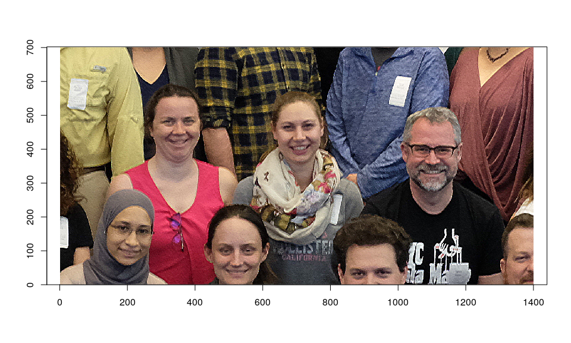

# Introduction

The
[`rip.recover`](https://github.com/deepayan/rip/tree/main/rip.recover)
package provides tools for image recovery or reconstruction. In an
abstract sense, this is the problem of estimating an (unobserved)
latent image given a degraded version that has been observed. In
practice, only certain specfic types of image degradation are handled
by this package, and an even more specific set of solutions
(estimators) are implemented.

Generally speaking, the types of degradation that are considered are
(a) blurring or convolution by a blur kernel or point spread function
(PSF), (b) downscaling, and (c) noise.

The classical solution to the _non-blind deconvolution_ problem, which
is to reconstruct a blurred image (with added noise) when the blur
kernel is known, is the Richardson-Lucy algorithm. This is implemented
through the `rip.deconvlucy()` function.

The main contribution of the package is to provide an alternative
Bayesian approach that uses a prior on image gradients to implement a
unified solution to both deconvolution and upscaling
(super-resolution). The prior also allows for image gradients to be
correlated. In addition to the usual conjugate-gradient approach, the
package also implements a direct solution using sparse matrix
computations (via the
[`Matrix`](https://cran.r-project.org/package=Matrix) package). The
latter approach allows missing values in the input image, and these
are imputed to provide a form of inpainting. See `help(rip.deconv)`
for details.

The blur kernel is usually unknown in practice. This package also
provides a fast and simple procedure to estimate a blur kernel from a
blurred input image, assuming the same prior for image gradients. This
is of limited use because it assumes symmetry of the blur kernel; this
gives reasonable results for blurring due to slight lack of focus, but
is unable to handle blurring due to camera shake. The procedure is
implemented as the `symmetric.blur()` function.


# Example: estimation of blur kernel

For illustration, we will use an example image from the
[opencv](https://github.com/ropensci/opencv) package README.


```r
suppressMessages(library(rip.recover))
if (!file.exists("unconf18.jpg"))
    download.file("https://jeroen.github.io/images/unconf18.jpg", dest = "unconf18.jpg")
y <- rip.import("unconf18.jpg", type = "original") / 255
y
```

```
[3264 x 4896] image with 3 channel(s)
```

This is a fairly large image, and we will work with a cropped
subimage.


```r
a <- as.array(y)
o <- round(0.5 * dim(a)[1:2])
z <- as.rip(a[-350:350 + o[1], -700:700 + o[2], , drop = FALSE])
z
```

```
[701 x 1401] image with 3 channel(s)
```

```r
image(255 * z, rescale = FALSE)
```


In principle, one should perform gamma correction on the input image
first to make the pixel values proportional to scene brightness. This
usually does not make much difference, but we will do it
(approximately) anyway.


```r
GAMMA <- 2.2
z[] <- z^(1/GAMMA)
```

The image above is blurred, but only slightly, and the
`symmetric.blur()` function may be able to estimate the blur kernel
reasonably well.


```r
khat.iid <- symmetric.blur(z, kdim = c(10, 10), g.method = "none", trim = FALSE)
khat.ar <- symmetric.blur(z, kdim = c(10, 10), g.method = "autoreg", trim = FALSE)
par(mfrow = c(1, 2))
image(-khat.iid, main = "Estimated kernel (IID prior)")
image(-khat.ar, main = "Estimated kernel (AR prior)")
```


# Example: Richardson-Lucy deconvolution

To deblur the image using the Richardson-Lucy algorithm, we use the
estimated kernel based on the AR prior, first restricting it to have a
slightly smaller size.


```r
khat <- symmetric.blur(z, kdim = c(9, 5), g.method = "autoreg", trim = FALSE)
khat
```

```
[19 x 11] image with 1 channel(s)
```

We can obtain the reconstructed image as follows.


```r
x <- rip.deconvlucy(z, k = khat, niter = 50)
image(255 * x^GAMMA, rescale = FALSE)
```



The image is now slightly sharper, although not all the blurrnig in
the image has been accounted for. This is probably because at least
some of the blur is due to camera shake (as opposed to lack of focus),
and asymmetric, which `symmetric.blur()` is unable to estimate (more
sophisticated methods are available for such blurs, but not yet
implemented in this package).

But another problem in the recovered image is that it has become
grainy. The `rip.recover` package allows image reconstruction using a
Bayesian approach, supporting the so-called hyper-Laplacian family of
priors for image gradients that also allows the gradients to be
locally correlated; see `help(rip.deconv)` for details. This approach
is much slower than the Richardson-Lucy algorithm, but a comprehensive
set of examples can be found
[here](https://www.isid.ac.in/~deepayan/rip/html), with the
corresponding code available [here](https://github.com/deepayan/rip.testing).

Here, we give a simple example where the Bayesian image reconstruction
approach is used as a post-processing step to denoise the output of
the Richardson-Lucy algorithm. It uses a so-called "sparse" prior
($\alpha = 0.8$), with image gradient density proportional to
$e^{-\lvert x \rvert^\alpha}$, with the gradients correlated according
to a 2-D auto-regressive model. In addition, a robust (Huber) loss
function comparing the input and estimated images is minimized instead
of squared error loss.


```r
x2 <- rip.denoise(x, ksigma = 0, method = "direct",
                  patch = 250, overlap = 10, yerror = "huber", huber.k = 1,
                  alpha = 0.8, rho = list(along = 0.3, across = 0.6), lambda = 0.025)
image(255 * x2^GAMMA, rescale = FALSE)
```


The estimated images can also be exported for comparison in an
external viewer.


```r
rip.export(255 * z^GAMMA, "figure/cropped-original.jpg")
rip.export(255 * x^GAMMA, "figure/cropped-lucy.jpg")
rip.export(255 * x2^GAMMA, "figure/cropped-lucy-sparse-ar-robust.jpg")
```

Links:

- [Original image (cropped)](figure/cropped-original.jpg)
- [Richardon-Lucy reconstruction](figure/cropped-lucy.jpg)
- [Richardon-Lucy followed by Bayesian reconstruction](figure/cropped-lucy-sparse-ar-robust.jpg)


The [project page](https://github.com/deepayan/rip) on Github can be
used for bug reports and patches.


